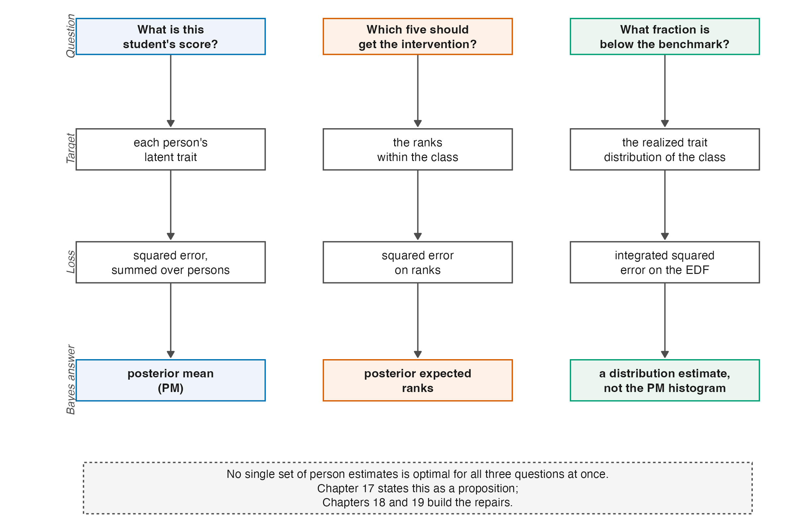

# The Estimation Problem {#sec-ch01}

```{r}
#| label: setup-ch01
#| include: false
tbl <- function(id) readRDS(file.path("..", "..", "tables", paste0(id, ".rds")))
```

A teacher gives a twenty-item screening test to a class of sixty at the start of term
and asks three questions of the result. What is this student's score? Which five
students should get the intervention? What fraction of the class is below the
benchmark?

The three questions look like three readings of one set of numbers. They are not. They
are three different estimands, they are optimally answered by three different sets of
estimates, and the set that answers any one of them answers the other two worse than a
purpose-built alternative would. That is the problem this book is about, and everything
in it is either a tool for stating the problem precisely or a consequence of taking it
seriously.

## Three questions, three targets {#sec-ch01-three}

Write $\theta_p$ for the latent trait of person $p$ and suppose for the moment that the
model and its item parameters are known, so that the only difficulty is what to report.

The first question asks for a **point estimate of an individual parameter**. Its natural
loss is squared error, averaged over the class, and the estimator that minimizes it is
the posterior mean. Shrinking each student's estimate toward the class average buys a
variance reduction that outweighs the bias it introduces, which is why the posterior
mean wins and why it is the default in operational scoring.

The second question asks for a **ranking**. Its loss is a discrepancy between estimated
and true ranks, and the estimator that minimizes it *need not be* the ranking of the
posterior means. The two coincide for some posterior families but not in general. Ranks
are a different functional of the posterior, so an optimal estimate of each trait does
not automatically induce an optimal estimate of their ranks. @sec-ch17 makes that precise
and @sec-ch20 explains why rank recovery turns out to depend on the test's reliability
and on almost nothing else.

The third question asks for a **feature of the distribution** — a tail proportion. Here
the relevant object is the empirical distribution of the class's traits, and the
posterior means are the wrong thing to feed it. They are shrunk toward the centre, so
their spread understates the true spread. For a lower-tail benchmark below the shrinkage
centre, applying the cut-score to posterior means will generally report too few students
below it; for a cutoff above the centre, the direction can reverse. The raw within-person
estimates carry measurement noise on top of the true variation, so their spread generally
overstates it. Neither histogram is the histogram of the $\theta_p$.

That the same posterior supports three different answers, and that no single set of
numbers is simultaneously best for all three, is not a defect of any estimator. It
is a consequence of the goals being different, and @sec-ch17 states it as a
proposition rather than an observation. @fig-estimand-map lays the three columns
side by side, and the rest of the book can be read as filling in its rows.

::: {#fig-estimand-map}



:::

## Two levers {#sec-ch01-levers}

Between the responses and the answers sit two choices.

The first is the **assumed distribution of the latent trait**, written $G$ throughout
this book. Marginal-likelihood and hierarchical Bayesian formulations require a model
for how $\theta$ is distributed in the population, and the usual choice is normal.
Fixed-effects joint likelihood does not require $G$, and Rasch conditional likelihood
can eliminate the person parameters without specifying it. @sec-ch02 separates these
cases; @sec-ch13 asks whether a normal $G$ is empirically defensible; @sec-ch14 and
@sec-ch15 develop alternatives.

The second is the **posterior summary** — what function of the fitted posterior gets
reported. The posterior mean is one choice. Constrained Bayes (@sec-ch18) rescales it so
that the reported ensemble has the right variance. The triple-goal estimator
(@sec-ch19) maps posterior ranks onto the quantiles of an estimated distribution so that
the ensemble has both the right shape and the right order.

Practitioners choose both, usually without noticing the second is a choice at all. The
manuscript this book supports asks what happens when the two are chosen together, and
finds that the answer depends on how much information the test carries. Which brings us
to the quantity that governs everything else.

## What "reliability" means here, and why 0.7 needs a scale attached {#sec-ch01-reliability}

The claim that measurement models are "frequently applied to data with reliability below
0.7" is the kind of statement that passes unchallenged and should not. Reliability of
what, computed how, on what scale? Reviewer 2 asked exactly this, and the honest answer
takes a chapter (@sec-ch08). The short version is that all the coefficients in use are
versions of one ratio,

$$
\frac{\text{variance attributable to true differences between persons}}
     {\text{that variance plus measurement error variance}},
$$ {#eq-reliability-shape}

and they differ in how each term is estimated. Coefficient alpha, the Rasch
person-separation reliability, EAP reliability, and WLE reliability can all be computed
on the same responses and can disagree materially. A number without its coefficient
named is not interpretable.

What can be said without ambiguity is that the ratio is bounded by one, that a value of
0.5 means half the observed spread is noise, and that short tests in ordinary classrooms
routinely land there. Three sources give the range.

**Curriculum-based measurement.** Conoyer et al. [-@conoyer_meta-analysis_2022] tabulate
twenty assessment-level rows for content-area curriculum-based measures. Reliability
coefficients in that table run from **.21** to **.89**, on instruments of **20 to 60
items**, with assessment samples from **25 to 967** persons. The twenty sample sizes have
R type-7 quartiles 61.75, 147, and 245.5. The bottom of the reliability range is not a
curiosity; it is a published assessment in use.

**Large-scale assessment, disaggregated.** Overall reliabilities in large surveys are
high, but subgroup reliabilities are not. Rutkowski and Rutkowski
[-@rutkowski_measuring_2013] report values as low as .41 for PISA socioeconomic
subscales in some groups, and Abedi [-@abedi_standardized_2002, Table 9] reports Grade 9
Stanford 9 subscale reliabilities of .80 to .92 for English-only students against .53 to
.83 for English language learners — a gap that widens with the language load of the
subject, from reading comprehension (.92 against .83) to social science (.81 against .53).

**The corpus view.** Since the manuscript was submitted, the question has acquired a
census answer. Applying the same estimators under the same rules to 889 datasets of
the Item Response Warehouse — with no author discretion about what to compute or
report — the corpus study of this programme finds a median marginal reliability of
.86 under its lenient definition and .80 under its strict one, with the share of
datasets below .80 running from 30 to 50 percent depending on the definition alone
[@lee_reliability-distribution_2026]. The range the three sources above sketch is
not a collection of unlucky examples; it is what measurement practice delivers, at
scale, and @sec-ch28 reports the study properly.

**The design consequence.** Reliability is not a property of a test. It is a property of
a test administered to a population, and it moves with the spread of that population as
much as with the instrument (@sec-ch08). This is why it can be treated as a design
factor at all, and why the companion simulation varies it deliberately rather than
observing it.

::: {.callout-note appearance="simple"}
::: {.ms}
**Verification of the submitted manuscript.** The manuscript's § 6.1 reports 20
assessment-level sample sizes from 25 to 967, with quartiles 62, 147, and 245. A visual
reconstruction of Conoyer et al.'s Table 1 supports the unit and range. Ford and Hosp's
study total of 1,545 is printed alongside two grade-level assessment samples, 799 and
746; the assessment-level calculation uses the latter two, not the combined total.

For the resulting 20 values, R's type-7 quartiles are 61.75, 147, and 245.5. Thus the
manuscript's integer summary is substantively reproduced, although its reported third
quartile is one below half-up rounding. The earlier version of this book changed the unit
to 19 studies and incorrectly treated 1,545 as an assessment sample; correction C-007
records the withdrawal of that claim.
:::
:::

## What this book does with all that {#sec-ch01-roadmap}

Parts II and III build the apparatus: the measurement models and their identification,
then information, measurement error, and the reliability coefficients that summarize
them. Part IV derives shrinkage and places it in the empirical-Bayes tradition it comes
from. Part V asks what happens when the normal assumption on $G$ is relaxed, ending in
Dirichlet process mixtures. Part VI returns to the three questions of
@sec-ch01-three and derives an estimator for each. Part VII positions the whole against
its nearest neighbour in the literature and closes the Rasch-centred theory spine with an
open-problem ledger. The broad title is an umbrella over that spine, not a claim that the
book develops Rasch and 2PL in parallel.

Two parts are new in this edition. Part VIII, **What Changes Under the 2PL**, follows three
specific departures from the Rasch apparatus: what discrimination does to information
(@sec-ch24), how uneven information separates reliability functionals (@sec-ch25), and
what a free scale changes for identification and the DPM (@sec-ch26). Part IX reads the
realized evidence of the companion volumes and the Warehouse studies back into the theory,
under rules the front matter states. @sec-ch23 is therefore a hinge into those two parts,
not the end of the book.

There are three useful entry paths:

- For the shortest theoretical core, read @sec-ch08 for reliability, @sec-ch17 for the
  conflict among inferential goals, and @sec-ch04 for identification.
- To follow the item-model comparison, start with the common foundations in @sec-ch03,
  then read @sec-ch24, @sec-ch25, and @sec-ch26 in order.
- To move from unresolved theory to evidence and disposition, read @sec-ch23 and then
  @sec-ch27 through @sec-ch29.

## Sources and provenance {#sec-ch01-sources}

The three-goal framing is Shen and Louis's [-@shen_triple-goal_1998], and this book follows
their formulation throughout; @sec-ch17 gives it properly. It reaches the present
setting through Lee et al. [-@lee_improving_2025], who applied it to site-level effects
in multisite trials, and @sec-ch21 sets out what does and does not carry across.

The curriculum-based measurement context comes from Conoyer et al.
[-@conoyer_meta-analysis_2022] and Nelson et al. [-@nelson_review_2023], and the
disaggregated-reliability evidence from Rutkowski and Rutkowski
[-@rutkowski_measuring_2013] and Abedi [-@abedi_standardized_2002]. The corpus
figures are the Item Response Warehouse reliability study's
[-@lee_reliability-distribution_2026], read from its manuscript; @sec-ch28 gives
that study's design and the assertions under which its per-unit frame is used
here. The numbers quoted
in @sec-ch01-reliability were visually reconstructed from the assessment-level rows of
Conoyer's Table 1, and the quantiles use R's type-7 convention. A non-load-bearing claim
attributed in the manuscript to an unresolved Ramsay (2016) reference has been omitted
rather than carried with an unverifiable citation.
