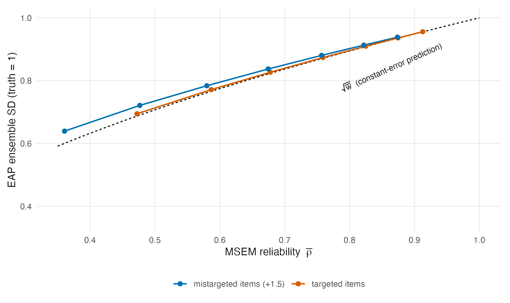

# The Conditional Posterior and Shrinkage {#sec-ch11}

@sec-ch10 wrote the model. This chapter takes one person out of it and asks what the data
say about them. The answer — a posterior that is a compromise between the person's own
responses and the population they were drawn from — is the shrinkage estimator, and
deriving it properly does three jobs at once: it produces the EAP estimator of
@sec-ch06-family from first principles, it settles what "the variance of $\theta_p$"
means, which Reviewer 2 correctly noted is framework-dependent, and it exposes the defect
that the whole of Part VI exists to repair.

## The conditional posterior {#sec-ch11-posterior}

Condition @eq-joint-posterior on the item parameters and hyperparameters and look at a
single person. What remains is

$$
p(\theta_p \mid \mathbf{u}_p; \boldsymbol\beta, \boldsymbol\delta)
= \frac{L(\theta_p, \boldsymbol\beta \mid \mathbf{u}_p)\, g(\theta_p \mid \boldsymbol\delta)}
       {\int L(t, \boldsymbol\beta \mid \mathbf{u}_p)\, g(t \mid \boldsymbol\delta)\,dt},
$$ {#eq-cond-post}

with $L$ the person likelihood of @eq-person-lik. Local independence
(@sec-ch03-lsi) does the work here: @eq-cond-post depends on the other $P-1$ people only
through $\boldsymbol\beta$, so once the items are settled every person's posterior is a
separate one-dimensional problem. That is the structural fact that makes person scoring
cheap, and it is also the fact that makes the ensemble problem of
@sec-ch11-ensemble invisible if you only ever look at one person at a time.

@eq-cond-post has no closed form. The Rasch likelihood is logistic and the prior is
Gaussian; the product is neither, and the normalizing integral is evaluated by quadrature,
Laplace approximation, or MCMC. Everything analytic below is therefore about an
*approximation* to @eq-cond-post, and saying so once loudly is better than hedging in
every subsequent sentence.

## The normal working model {#sec-ch11-working}

Replace the person likelihood by a Gaussian centred at the ML estimate with the
curvature the likelihood actually has at its maximum:

$$
L(\theta_p \mid \mathbf{u}_p) \;\propto\;
\exp\!\left\{-\frac{(\theta_p - \hat\theta_p)^2}
                   {2\,\operatorname{se}(\hat\theta_p)^2}\right\},
\qquad
\operatorname{se}(\hat\theta_p)^2 = \mathcal{J}(\hat\theta_p)^{-1} .
$$ {#eq-working}

This is the second-order Taylor expansion of the log-likelihood at $\hat\theta_p$, and it
is the same asymptotic statement as @eq-sem. Its quality is not uniform.

It is good when the test is long, the person is near the centre of the item difficulties,
and the score is interior. It degrades when any of those fails: the Rasch person
likelihood is skewed for extreme scores, and @sec-ch06-boundary showed it has **no
maximum at all** at a perfect or zero score, so @eq-working does not merely approximate
badly there — it does not exist. The exact posterior @eq-cond-post is perfectly
well-behaved in that case, because the prior supplies the tail the likelihood lacks. This
asymmetry is worth holding onto: the approximation fails exactly where the Bayesian
machinery is most useful.

Since the entire shrinkage algebra below rests on @eq-working, every result in
@sec-ch11-conjugacy and @sec-ch11-limits is exact for the working model and approximate
for the Rasch model. The distinction was blurred in the Appendix C draft and is recorded
as `C-006`.

## Normal–normal conjugacy {#sec-ch11-conjugacy}

::: {#thm-eap-shrinkage}
**EAP as a shrinkage estimator.** *Adapted from Louis (1984, § 2.1); proved inline in
this notation*

Under the working likelihood @eq-working and the prior $\theta_p \sim N(\mu_\theta,
\sigma^2_\theta)$, the posterior is Gaussian with

$$
\operatorname{E}(\theta_p \mid \mathbf{u}_p)
= w_p\,\hat\theta_p + (1-w_p)\,\mu_\theta,
\qquad
w_p = \frac{\sigma^2_\theta}{\sigma^2_\theta + \operatorname{se}(\hat\theta_p)^2},
$$ {#eq-eap-shrinkage}

and

$$
\operatorname{Var}(\theta_p \mid \mathbf{u}_p)
= \left(\mathcal{J}(\hat\theta_p) + \sigma^{-2}_\theta\right)^{-1}
= w_p \operatorname{se}(\hat\theta_p)^2
= (1-w_p)\,\sigma^2_\theta .
$$ {#eq-post-var}
:::

*Proof.* Write the log of the product of @eq-working and the prior, collect the quadratic
and linear terms in $\theta_p$, and complete the square. With likelihood precision
$\tau_L = \operatorname{se}(\hat\theta_p)^{-2}$ and prior precision $\tau_\pi =
\sigma^{-2}_\theta$, the posterior precision is $\tau_L + \tau_\pi$ and the posterior mean
is the precision-weighted average $(\tau_L\hat\theta_p + \tau_\pi\mu_\theta)/(\tau_L +
\tau_\pi)$. Dividing numerator and denominator by $\tau_L + \tau_\pi$ and substituting
gives @eq-eap-shrinkage; the two right-hand forms in @eq-post-var follow by substituting
$w_p$. ∎

The precision reading is the one to keep. Precisions add, and the posterior mean weights
each source by the precision it brings. Nothing in @thm-eap-shrinkage is specific to
psychometrics — it is the same algebra that produces the Kalman filter and the
random-effects estimator, and @sec-ch12 is about that fact.

## Limits, and the reliability connection {#sec-ch11-limits}

**Limiting behaviour.** These are elementary consequences of @thm-eap-shrinkage.

As $\operatorname{se}(\hat\theta_p)^2 \to 0$, $w_p \to 1$ and the EAP converges to
$\hat\theta_p$: a perfectly informative test needs no prior. As $\operatorname{se}
(\hat\theta_p)^2 \to \infty$, $w_p \to 0$ and the EAP converges to $\mu_\theta$: an
uninformative test returns the population mean. As $\sigma^2_\theta \to \infty$ with
$\operatorname{se}$ fixed, $w_p \to 1$ and the estimator becomes ML: a prior that asserts
nothing does nothing.

These are one-line limits and are not claimed as anything more; the Appendix E draft
marked them as awaiting a prior-art search, and the search is unnecessary because there
is no result here to attribute.

The third limit is the one worth pausing on. It says the Bayesian and frequentist
estimators are not two philosophies but two ends of a continuum indexed by
$\sigma^2_\theta$, and @sec-ch10-parallel already made the corresponding point about the
model. What sits at neither end is the interesting case, and where it sits is decided by
$w_p$. This is the *local normal-working shrinkage weight* for person $p$, and it is
analogous to reliability rather than identical to the ensemble coefficient. As
@sec-ch08-shrinkage showed, $P^{-1}\sum_p w_p \ge \bar w$, with equality only under
constant working error variance; exact Rasch EAP weights need not have the closed form
used here. @fig-shrinkage-weight plots the local working quantity.

{#fig-shrinkage-weight}

## The posterior variance is smaller, and that is not a free lunch {#sec-ch11-postvar}

@eq-post-var says the posterior variance is below both the prior variance
$\sigma^2_\theta$ and the sampling variance $\operatorname{se}(\hat\theta_p)^2$, by
factors $(1-w_p)$ and $w_p$ respectively. It is tempting to read this as the Bayesian
estimator being more precise for free. Three things block that reading.

**It answers a different question.** $\operatorname{se}(\hat\theta_p)^2$ is the sampling
variance of an estimator around a fixed $\theta_p$; @eq-post-var is the spread of a
posterior around its own mean. These are not competing answers to one question
(@sec-ch11-framework).

**It is bought with bias.** The EAP is biased toward $\mu_\theta$ by $(1-w_p)(\mu_\theta -
\theta_p)$ under the working model, and the trade is favourable in mean squared error
precisely because squared-error loss is what the posterior mean minimizes. Change the loss
and the trade changes sign, which is the argument of @sec-ch17.

**It conditions on whatever was plugged in.** @eq-post-var conditions on
$\boldsymbol\beta$ and $\boldsymbol\delta$. In empirical Bayes both are estimated, so the
reported conditional posterior omits uncertainty in those estimates — the same omitted
source @prp-plugin records for the frequentist standard error, arriving by a different
route. This does not imply a pointwise ordering between the plug-in variance and the full
posterior variance; `C-012` covers the scope, and @sec-ch11-eb-vs-fb gives the identity.

## What "the variance of $\theta_p$" means {#sec-ch11-framework}

Reviewer 2's fourth bullet asked what variance is meant when the paper writes
$\operatorname{Var}(\theta_p)$. The honest answer is that three different quantities have
been called that, and which one is meant depends on the framework.

Under the **frequentist** reading, $\theta_p$ is a fixed unknown constant. It has no
variance. What has a variance is the estimator, and $\operatorname{se}(\hat\theta_p)^2 =
\operatorname{Var}(\hat\theta_p \mid \theta_p)$ is a within-person sampling variance. The
population variance $\sigma^2_\theta = \operatorname{Var}_G(\theta_p)$ also exists, but it
describes the *spread of true abilities across people* and says nothing about uncertainty
in any particular one.

Under the **Bayesian** reading, $\theta_p$ is random and has three relevant variances: the
prior variance $\sigma^2_\theta$, the posterior variance @eq-post-var, and — for
predicting new responses — the posterior predictive variance, which adds the Bernoulli
noise back in.

The reconciliation is not that the frameworks agree, and pretending they do is the error
worth avoiding. It is that **the same symbol plays the same algebraic role while denoting
different things**: $\sigma^2_\theta$ is a structural population parameter to be
estimated in one and a prior hyperparameter to be integrated over in the other, and
@eq-eap-shrinkage is the same formula in both because the algebra does not care.
@sec-ch02-frameworks tabulates the correspondence.

What follows practically is a naming rule the rest of this book obeys.
$\operatorname{se}(\hat\theta_p)^2$ is never called "the variance of $\theta_p$";
$\sigma^2_\theta$ is called the between-person variance; and @eq-post-var is called the
posterior variance and is never compared directly with $\operatorname{se}
(\hat\theta_p)^2$ as though one were a better version of the other.

## The ensemble is wrong in both directions {#sec-ch11-ensemble}

Everything so far has been about one person, and everything so far has been reassuring.
Now put the estimates side by side.

::: {#prp-underdispersion}
**Neither ensemble has the right spread.** *Adapted from Louis (1984, § 2.1); the law-of-
total-variance and constant-error algebra are given inline*

Let $\theta_p \sim G$ with variance $\sigma^2_\theta$. Then

$$
\operatorname{Var}\!\left(\operatorname{E}[\theta_p \mid \mathbf{u}_p]\right)
= \sigma^2_\theta - \operatorname{E}\!\left[\operatorname{Var}(\theta_p \mid \mathbf{u}_p)
\right]
\;<\; \sigma^2_\theta
$$ {#eq-underdisp-general}

for any prior and likelihood with $\operatorname{Var}(\theta_p \mid \mathbf{u}_p) > 0$,
and under the working model with constant $\operatorname{se}^2$ the under-dispersion is
exactly the reliability:

$$
\operatorname{Var}(\hat\theta^{\mathrm{EAP}}) = \bar w\,\sigma^2_\theta,
\qquad
\frac{\operatorname{SD}(\hat\theta^{\mathrm{EAP}})}{\sigma_\theta} = \sqrt{\bar w} .
$$ {#eq-underdisp-exact}

Meanwhile @eq-overdisp gives $\operatorname{Var}(\hat\theta^{\mathrm{ML}}) =
\sigma^2_\theta + \mathrm{MSEM} > \sigma^2_\theta$.
:::

*Proof.* @eq-underdisp-general is the law of total variance,
$\operatorname{Var}(\theta) = \operatorname{Var}(\operatorname{E}[\theta \mid \mathbf{u}])
+ \operatorname{E}[\operatorname{Var}(\theta \mid \mathbf{u})]$, rearranged. For
@eq-underdisp-exact, $\hat\theta^{\mathrm{EAP}} = \bar w\hat\theta^{\mathrm{ML}} +
(1-\bar w)\mu_\theta$ has variance $\bar w^2(\sigma^2_\theta + \operatorname{se}^2) =
\bar w^2\sigma^2_\theta/\bar w = \bar w\sigma^2_\theta$, using $\sigma^2_\theta +
\operatorname{se}^2 = \sigma^2_\theta/\bar w$. ∎

@eq-underdisp-exact is worth reading slowly, because it converts an abstract worry into a
number. At $\bar w = 0.5$ the histogram of posterior means has $\sqrt{0.5} = 71\%$ of the
true standard deviation. At $\bar w = 0.9$ it has $95\%$. The reliability levels of
@sec-ch09-table2 are exactly the levels at which this ranges from severe to mild, which
is why the companion simulation varies reliability rather than fixing it.

It is equally worth remembering what @eq-underdisp-exact is: an identity of the
constant-error working model, not of the Rasch model. Under exact Rasch posteriors the
error variance moves with $\theta$, the two averages of @sec-ch08-functionals part
company, and the realized ensemble contraction is $\sqrt{\bar w}$ only approximately.
@fig-shrink-deviation computes the exact version across designs and shows the rule
holding closely when items are targeted and separating visibly when they are not —
with the direction of the separation a property of the design rather than of the
model. Sentences elsewhere in this book that lean on $\sqrt{\bar w}$ carry this
qualification implicitly, and @sec-ch13 states it again where it matters most.

::: {#fig-shrink-deviation}


:::

![**Left:** why neither obvious histogram estimates the distribution of the latent traits. Simulated with unit latent variance and a fixed constant error variance. The within-person estimates carry measurement noise on top of the true variation and are too spread out; the posterior means are shrunk and too concentrated. A cut-score applied to either misstates the proportion below it, in opposite directions. **Right:** the same machinery under a sharply bimodal truth, with the constrained-Bayes repair of @sec-ch18. CB restores the standard deviation almost exactly. It does not restore the shape, and cannot: @prp-cb-affine shows CB is a positive affine map of the posterior means, so every standardized moment above the second is inherited unchanged — the excess kurtosis stays at the posterior means' value while the truth's is far lower. Bimodality is a shape feature and an affine map has no access to it. Seeds fixed; numerical moments and KS distances are frozen in tables/F-ensemble-shrink-summary.rds with a CSV mirror; illustrative, no inference rests on it. Generated by code/R/09-figures.R.](../figures/F-ensemble-shrink.png){#fig-ensemble-shrink}

@fig-ensemble-shrink shows both failures on one set of simulated data. The point is not
that one estimator is bad. Each is optimal for what it was built for: ML is unbiased for a
fixed $\theta_p$ up to $O(I^{-1})$, and the EAP minimizes squared-error loss person by
person. The point is that **optimality for each person separately does not deliver
optimality for the ensemble**, and there is no reason it should — a criterion summed over
persons is not the same criterion as one applied to the collection.

Louis [-@louis_estimating_1984] is where this was first taken seriously as a problem to be
fixed rather than a curiosity, in the compound Gaussian setting: posterior expectations
"produce ensembles of estimates with a sample variance smaller than the posterior expected
sample variance for parameters," and the repair is to weight the data by approximately the
*square root* of the posterior-expectation weight. That constant is not arbitrary and
falls straight out of @eq-underdisp-exact: an estimator $a\hat\theta^{\mathrm{ML}} +
(1-a)\mu_\theta$ has ensemble variance $a^2\sigma^2_\theta/\bar w$, which equals
$\sigma^2_\theta$ exactly when $a = \sqrt{\bar w}$. @sec-ch18 develops this as constrained
Bayes; @sec-ch19 goes further and matches the whole distribution rather than its first two
moments.

Rank estimation is a second ensemble question, but not an automatic second failure in the
common-form IRT model. A positive monotone rescaling cannot change an existing ordering;
whether the posterior-mean ordering is itself wrong depends on stochastic ordering of the
person posteriors. @sec-ch12 shows that fixed-item Rasch posteriors satisfy that ordering,
while heterogeneous designs and shared parameter uncertainty require a separate analysis.
That conditional question, rather than non-constant information by itself, is what
@sec-ch20 must resolve.

## Empirical Bayes and full Bayes {#sec-ch11-eb-vs-fb}

Everything above conditioned on $(\boldsymbol\beta, \boldsymbol\delta)$. Two ways of
discharging that conditioning are in use.

**Empirical Bayes** estimates them — typically $\hat{\boldsymbol\beta}$ and
$\hat{\boldsymbol\delta}$ from marginal maximum likelihood — and substitutes. The
resulting estimator has the form @eq-eap-shrinkage with hats, is justified by minimizing
expected squared error under the assumed population model rather than by any Bayesian
argument, and is what a great deal of software returns.

**Full Bayes** places hyperpriors and integrates, as in @eq-joint-posterior. The
person-level posterior is then the *marginal* posterior of $\theta_p$, having averaged
over the hyperparameters.

What empirical Bayes omits is uncertainty in what it plugs in. Under full Bayes,

$$
\operatorname{Var}(\theta_p\mid\mathbf u)=
\operatorname{E}\!\left[\operatorname{Var}(\theta_p\mid\mathbf u,
\boldsymbol\delta)\mid\mathbf u\right]
+\operatorname{Var}\!\left(\operatorname{E}[\theta_p\mid\mathbf u,
\boldsymbol\delta]\mid\mathbf u\right).
$$ {#eq-eb-total-variance}

The second term is nonnegative, but this identity compares the full variance with an
**average** conditional variance. It does not order the arbitrary plug-in value
$\operatorname{Var}(\theta_p\mid\mathbf u,\hat{\boldsymbol\delta})$ against that average;
the plug-in value can lie above or below it. The size and direction of the numerical
difference are model- and data-dependent. @sec-ch16 returns to the larger uncertainty
object when $\boldsymbol\delta$ includes a distribution.

## Sources and provenance {#sec-ch11-sources}

@eq-cond-post, @eq-working, @thm-eap-shrinkage and @eq-post-var follow the Appendix E
draft §§ E.2–E.4, which derives them in this notation; the completing-the-square proof is
standard normal–normal conjugacy and is restated rather than attributed, since it predates
the psychometric literature entirely. Bock and Mislevy [-@bock_adaptive_1982] is the
standard psychometric reference for EAP scoring by quadrature.

The limits in @sec-ch11-limits are elementary. The Appendix E draft flagged that block as
needing a prior-art search; none is required, because taking three limits of
@eq-eap-shrinkage is prose rather than a numbered result.

The framework-dependence discussion of @sec-ch11-framework is the Appendix E draft § E.5,
sharpened on one point: the draft's table lists the frequentist interpretation of
$\sigma^2_\theta$ as "population variance" and the Bayesian as "prior variance" without
saying that under the strict frequentist reading $\theta_p$ has no variance at all. That
is the sentence Reviewer 2's question actually needs, and it is added here.

@prp-underdispersion splits its provenance deliberately. @eq-underdisp-general is the law
of total variance and @eq-underdisp-exact is two lines of algebra; both are derived here
and neither is claimed. What is Louis's [-@louis_estimating_1984] is the framing — that an
ensemble of estimates is a thing one might want to be right, that posterior means are
systematically not, and that the fix weights the data by roughly the square root of the
posterior weight. The abstract states the under-dispersion and the square-root weight
directly; both were read there and the square-root constant was then re-derived here from
@eq-underdisp-exact, which is why it appears as an identity rather than an approximation
in the constant-error case.

@fig-shrinkage-weight and @fig-ensemble-shrink are generated in `code/R/09-figures.R` and
were introduced in @sec-ch01; both are illustrative, both fix a seed, and nothing in this
chapter rests on either beyond what the algebra already establishes.
@fig-shrink-deviation is exact quadrature over Rasch score classes, added in this
edition (`code/R/23-figures-v2-theory.R`, values frozen in
`tables/F-shrink-deviation-summary.rds`); it exists to keep @eq-underdisp-exact
honest about its working-model status, and no inference rests on it beyond the
existence and design-dependence of the gap it displays.
