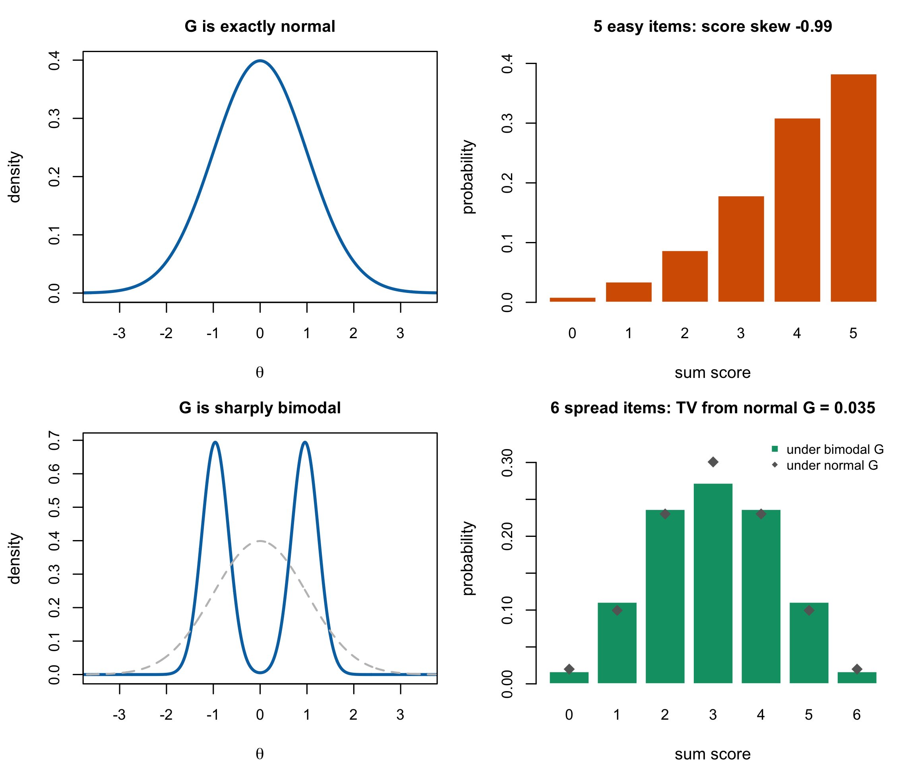

# Non-Normality in Latent Traits {#sec-ch13}

Part V asks what happens when $G$ is not normal, and the first question is whether that is
a real case or a hypothetical one. The literature has a stock answer — normality is
empirically rare, and Micceri (1989) is the citation — and the answer is right for the
wrong reason.

This chapter separates two claims that are routinely run together. That **observed score
distributions** in psychology and education are usually not normal is well established and
this chapter accepts it. That this constitutes evidence about the **latent trait
distribution** does not follow, and @prp-sumscore shows it does not follow in either
direction: a sum score can be markedly skewed when $G$ is exactly normal, and can be
symmetric and bell-shaped when $G$ is sharply bimodal.

The consequence is not that normality is safe. It is that the *evidence* for doubting it
has to come from somewhere else, and @sec-ch13-latent says where.

## What Micceri actually examined {#sec-ch13-micceri}

Micceri [-@micceri_unicorn_1989] surveyed 440 large-sample achievement and psychometric
measures and found **all of them** significantly non-normal at $\alpha = .01$. He
catalogued several classes of departure: tail weights ranging from uniform to double
exponential, exponential-level asymmetry, severe digit preferences, multimodalities, and
modes lying outside the interval between the mean and the median.

Two modern replications reach the same place with different corpora. Blanca et al.
[-@blanca_skewness_2013] examine 693 distributions at sample sizes of 10 to 30 and report
skewness from $-2.49$ to $2.33$ and kurtosis from $-1.92$ to $7.41$, with **only 5.5%**
close to the values normality would give. Cain et al. [-@cain_univariate_2017] collect
1,567 univariate and 254 multivariate distributions from authors publishing in
*Psychological Science* and the *American Educational Research Journal*, and find **74%**
and **68%** respectively departing from normality.

None of this is in dispute here, and none of it is about latent traits.

Micceri is explicit about what he is studying. He describes his measures as "discrete,
bounded" and notes that they "consist of a number of discrete data points"; his catalogue
of digit preferences is a catalogue of *response* artefacts. The paper is a survey of
observed distributions, it says so, and it is correct. What it acquired over three decades
of citation is a second reading — as evidence that latent variables are non-normal — and
that reading is the field's, not his.

## The sum-score fallacy {#sec-ch13-fallacy}

Under the Rasch model a person's sum score is $X_p = \sum_i U_{pi}$, which conditional on
$\theta_p$ is a sum of independent non-identical Bernoulli variables: a Poisson-binomial
with parameters $\pi_{pi} = \operatorname{logit}^{-1}(\theta_p - \beta_i)$. Its marginal
distribution is therefore

$$
\Pr(X = k) = \int \Pr(X = k \mid \theta)\, g(\theta)\, d\theta ,
$$ {#eq-sumscore}

a mixture of Poisson-binomials over $G$. Three features of @eq-sumscore make it a poor
window onto $g$. It is **bounded** on $\{0,\dots,I\}$ whatever $G$ does. It is
**discretized** to $I+1$ points. And it is **convolved** with conditional response noise
whose variance $\sum_i \pi_{pi}(1-\pi_{pi})$ is largest exactly where $\pi \approx 1/2$.

::: {#prp-sumscore}
**The sum-score distribution does not diagnose the latent distribution in either
direction.** *Specific counterexamples computed here*

Under the Rasch model:

(a) There are designs with $G$ **exactly normal** whose sum-score distribution is markedly
    skewed. With $G = N(0,1)$ and five items of difficulty $-1.5$, @eq-sumscore has
    skewness $-0.987$ and places $38.3\%$ of the population at the maximum score.

(b) There are designs with $G$ **sharply bimodal** whose sum-score distribution is
    symmetric and single-peaked. With $G$ an equal mixture of normals at $\pm 1$ with
    standard deviation $0.30$, standardized, and six items spread evenly over
    $[-2.5, 2.5]$, @eq-sumscore is $(0.017, 0.111, 0.237, 0.272, 0.237, 0.111, 0.017)$ —
    unimodal, exactly symmetric, and within **0.035 in total variation** of the sum-score
    distribution the same test produces under a standard normal $G$.

Consequently non-normality of the sum score is neither necessary nor sufficient for
non-normality of $G$.
:::

*Proof.* Both statements are exhibited by an exact Poisson-binomial recursion for
$\Pr(X = k \mid \theta)$ followed by fixed-grid numerical quadrature over $G$ on
$[-12,12]$ with 4,001 points, in `code/R/09-figures.R` and independently re-evaluated in
`code/R/15-derivation-checks.R`. The printed probabilities are numerical values, not
symbolic identities. ∎

@fig-nonnormal-shapes shows both. The lower right panel is the one to sit with: two latent
distributions as different as a standard normal and a pair of sharp spikes at $\pm 1$
produce score distributions whose cells differ by at most a few percentage points, and
both are almost indistinguishable from a symmetric binomial.

::: {#fig-nonnormal-shapes}


:::

### How much a test can reveal, quantitatively {#sec-ch13-tv}

The $0.035$ in (b) is not a fixed penalty. It is a property of the *test*, and it grows as
the test lengthens. For difficulties spread over $[-2.5,2.5]$ or $[-1.6,1.6]$, the total
variation between the sum-score distributions induced by a standard normal $G$ and by the
bimodal $G$ above is

| items | 6 | 9 | 20 | 60 |
|---|---|---|---|---|
| total variation | 0.035 | 0.066 | 0.172 | 0.305 |

For this particular pair of distributions and item design, separation is weak at six items
and larger at sixty. These TV values are not a power calculation: detectability also depends
on the multinomial cells, fitted nuisance parameters, test statistic and sample size. The
general conclusion is therefore narrower: **the score distribution's capacity to separate
specified alternatives is a design property**, and a short test can be weak for some
materially different latent shapes.

That statement has a corollary worth naming, because it cuts against this book's own
interest. If a short test cannot *reveal* the shape of $G$, then a short test also cannot
easily be *hurt* by getting the shape wrong, at least in what it says about scores. The
place where the shape matters is precisely where the data can see it, and @sec-ch13-goal
takes that up.

### This does not undercut the careful version {#sec-ch13-careful}

Li and Cai [-@li_summed_2018] use the summed score to test latent-distribution fit, and
@prp-sumscore is not an objection to their work. The difference is what the observed score
distribution is compared *against*. Reading a score histogram and judging whether it looks
normal compares it against a normal shape, which @prp-sumscore shows is the wrong
comparison. Li and Cai compare the observed summed-score distribution against the
**model-implied** one — @eq-sumscore evaluated under the fitted model — so the conditional
binomial noise, the item parameters and the boundedness are all already inside the
reference. Their statistics are, in their words, focused: powerful against latent
distributional violations and correctly insensitive to multidimensionality, and they
report that the limited-information index $M_2$ has considerably lower power against
latent non-normality than the summed-score indices do.

@prp-sumscore is a statement about the naive procedure, and an explanation of why the
careful one has to be as elaborate as it is.

## Where the latent-level evidence actually comes from {#sec-ch13-latent}

Three routes remain once the sum-score route is closed.

**Fitting a flexible $G$ and looking at it.** Empirical histogram, spline, Ramsay-curve
and Davidian-curve estimation all recover a $G$ from the responses rather than from the
scores, and a recovered $G$ that departs from normality is direct evidence. This is the
literature of @sec-ch14, and the caution attached to it is that a flexible estimator will
find structure in noise if allowed to, so the evidence is only as good as the
regularization. This route has now been walked at corpus scale: the Warehouse study of
this programme refits 504 real datasets under a normal and a flexible calibration that
differ in nothing else, finds the median flexible estimate sitting .109 from its normal
twin in cumulative probability with a majority of datasets beyond .10, and — the part
that answers the caution — checks its estimator dependence directly, with two flexible
estimators agreeing on the .10 landmark for about seven in eight datasets
[@lee_theta-nonnormality_2026]. The departures are real, they are common, and they are
overwhelmingly skew rather than multimodality; @sec-ch28 reports the study with its
design and its floor conditions attached.

**Testing distributional fit directly.** Li and Cai's [-@li_summed_2018] summed-score
likelihood indices, with their Satorra–Bentler moment adjustment, are the current form of
this. They test the latent distribution specifically rather than overall model fit, which
is what makes them evidence about $G$ rather than about the model as a whole.

**Substantive argument.** The strongest reasons to expect non-normality are not
statistical at all, and Li and Cai [-@li_summed_2018, § 1] set out two, following Woods
(2006). Severe symptoms of psychological disorders are rare in the general population and
most people sit at low levels, so a symptom trait should be **positively skewed** — the
skew is a fact about prevalence, not about measurement. And when a sample combines two or
more subpopulations with different means, calibrating items against the combined
population makes normality suspect and **multimodality** likely. To these the design
literature adds floor and ceiling effects and explicit selection, both of which truncate
rather than deform.

Note what these arguments have in common: each names a mechanism in the world that would
produce a particular departure. That is a different kind of evidence from a histogram, and
a better one, because it predicts the *shape* rather than merely rejecting a null.

## Consequences by inferential goal {#sec-ch13-goal}

Reviewer 1 asked what relaxing normality buys. The answer this book gives is that it
depends entirely on what is being estimated, and the three predictions below are stated as
predictions — they are the mechanism, and the companion simulation is what tests them.

**Individual estimates: modestly affected.** A misspecified $G$ changes $\mu_\theta$ and
$\sigma^2_\theta$, hence the shrinkage weight of @eq-eap-shrinkage, hence each posterior
mean. But the damage is bounded by how much weight the prior carries: at $w_p$ near 1 the
prior is nearly irrelevant, and at $w_p$ near 0 every estimate is near $\mu_\theta$ whether
or not the shape is right. The prediction is a modest effect, largest at middling
reliability.

**The recovered distribution: severely affected.** This is where the whole loss falls.
Under the constant-error Gaussian working model, @prp-underdispersion already showed that
even a *correctly specified* normal $G$ yields an ensemble whose spread is
$\sqrt{\bar w}$ of the truth; a misspecified shape adds a
systematic distortion on top, and it distorts in the direction of the assumed shape —
a normal prior pulls a bimodal truth toward unimodality. Any functional of the recovered
distribution inherits this: quantiles, the proportion beyond a cut-score, the estimated
spread.

**Ranks: a separate, conditional question.** A monotone transformation preserves order,
and @sec-ch12-ranks shows that fixed-item Rasch posteriors are stochastically ordered by
total score even though information is non-constant. Misspecifying $G$ can still change
rank uncertainty, posterior expected-rank values and results under heterogeneous forms or
shared item uncertainty, but differential local shrinkage alone is not a proof of person
reordering. Which residual rank target is sensitive to the shape of $G$ is therefore an
empirical prediction for the companion study, not a theorem of this chapter.

::: {.callout-note appearance="simple"}
::: {.ms}
**Two of the three have published support, in a neighbouring model.** Paddock et al.
[-@paddock_flexible_2006, § 6] report exactly this pattern for triple-goal estimates in the
two-stage Gaussian model: "the data-analytic choice for $G$ mattered relatively little when
using GR for estimating and ranking the $\theta$s, but GR estimates of the EDF and
percentiles of $G$ were very sensitive to model departures from the true distribution."
Their rank finding is stronger than the prediction above — the rank losses of ML, posterior
mean and triple-goal estimates were "very similar and indistinguishable, even when the
variances of the observations are heterogeneous" [-@paddock_flexible_2006, § 4.2.2.2].

They also find the effect is **reliability-dependent** in this programme's sense: "when the
data are quite informative, the GR estimates are quite robust to model misspecification…
However, conclusions can be quite sensitive to misspecification of the population
distribution when the data are less informative."

Two qualifications keep this evidence rather than proof. Their sampling model is Gaussian
with known unit variances, not a Rasch model whose information varies with $\theta$ in the
way @sec-ch07-information describes; and their estimator is the triple-goal one of
@sec-ch19, not the posterior mean. The predictions above therefore remain what the
companion book tests, with a strong prior on how the test comes out.
:::
:::

These three together are the reason Part VI is organized by goal rather than by estimator.
If the consequences of a modelling choice differ this much across goals, then an evaluation
that reports one number has answered one question and left the others open.

The predictions are no longer only predictions. The companion simulation has since
returned a verdict on each — direction confirmed for all three, the distribution effect
where the mechanism put it, the individual effect with a quantified exception region,
the rank question resolved to near-flatness — and @sec-ch27 reads the record back into
this chapter's terms, under the labelling rules stated there.

## Sources and provenance {#sec-ch13-sources}

Micceri [-@micceri_unicorn_1989] is read directly: the count of 440 measures, the
$\alpha = .01$ result, the catalogue of contamination classes, and his own description of
the measures as discrete and bounded are all from his abstract and introduction. The
reading of his paper as evidence about *observed* rather than latent distributions is a
statement about what the paper says, not a criticism of it; the misreading belongs to the
citing literature.

Blanca et al. [-@blanca_skewness_2013] and Cain et al. [-@cain_univariate_2017] are read
at the level of their reported counts and percentages, which is all that is used.

The structural observation behind @prp-sumscore — that observed score shape depends jointly
on $G$, the item parameters and conditional response noise — is established in the IRT fit
literature and is not claimed here. What is computed here is the particular pair of
counterexamples and the accompanying TV table: exact Poisson-binomial recursion followed by
fixed-grid quadrature, not simulation. The targeted search did not locate these same two
numerical constructions, but no priority claim is made.

Li and Cai [-@li_summed_2018] are read for their procedure, their focused-power result,
the $M_2$ comparison, and their § 1 summary of Woods's (2006) substantive arguments;
Woods (2006) is held but was not read for this chapter and is cited through Li and Cai
under R5.

The three goal-specific predictions in @sec-ch13-goal are this book's, follow from
@eq-eap-shrinkage and @prp-underdispersion, and are labelled predictions rather than
findings because the evidence for them is the companion simulation's, not this book's;
@sec-ch27 now carries that evidence, and the closing paragraph of @sec-ch13-goal points
to it without importing it. The corpus prevalence and estimator-agreement figures in
@sec-ch13-latent are the Warehouse shape study's [-@lee_theta-nonnormality_2026], read
from its manuscript and its corrected released frame as described in @sec-ch28.
