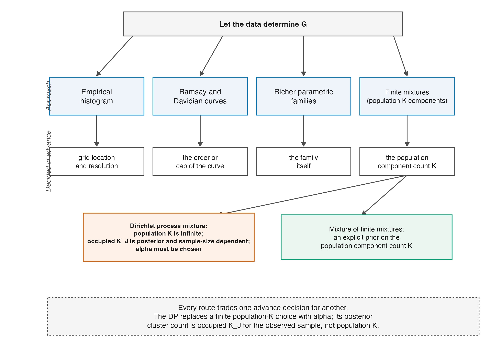

# Flexible Parametric and Semiparametric Alternatives {#sec-ch14}

```{r}
#| label: setup-ch14
#| include: false
tbl <- function(id) readRDS(file.path("..", "..", "tables", paste0(id, ".rds")))
```

"Let $G$ be flexible" is not a new idea, and the Dirichlet process is not the first
answer to it. This chapter is the genealogy, and it exists for a specific reason: a
reader deciding whether the semiparametric approach of @sec-ch16 is worth the trouble
needs to see what it buys *relative to the alternatives*, and that comparison is not
possible without knowing what the alternatives are.

The organizing question for the whole chapter is a single one. **What must the analyst
decide in advance?** Every family below can represent more shapes than a normal can, and
they differ mostly in what they demand to be told before they will do it.

## Estimating $G$ instead of assuming it {#sec-ch14-histogram}

The first move is the oldest. Mislevy [-@mislevy_estimating_1984] gives maximum
likelihood equations for the population parameters of $g(\theta \mid \alpha)$ estimated
"directly from the observed responses; i.e., without estimating an ability parameter for
each subject," together with asymptotic standard errors and tests of fit. This is the
marginal machinery of @sec-ch05-mml turned on $G$ itself rather than only on
$\boldsymbol\beta$, and it is the point at which $G$ becomes an object of estimation.

Its most-used form is the **empirical histogram**: $G$ is left free at the quadrature
points and estimated as a discrete distribution over them. It can represent any shape the
grid can resolve and it needs no functional form at all. What it costs is stability —
Li and Cai [-@li_summed_2018] report from their own experience that the empirical
histogram "is often less stable numerically than the standard normal prior," which is a
mild way of saying that a free parameter at every quadrature point is a great many
parameters.

## Smoothing: splines, Ramsay curves, Davidian curves {#sec-ch14-smoothing}

The next generation replaces "free at every grid point" with "smooth, with a controlled
number of degrees of freedom."

Woods and Thissen [-@woods_item_2006] estimate the latent density with **splines**,
simultaneously with the item parameters, and report that when the latent distribution is
poorly approximated as normal the 2PL item parameter estimates improve. **Ramsay-curve
IRT** [@woods_ramsay-curve_2006] does the same with Ramsay's density family, and Woods
extends it to Likert-type data [-@woods_ramsay_2007] and to the 3PL
[-@woods_ramsay-curve_2008]. Woods and Lin [-@woods_item_2009] introduce **Davidian-curve
IRT**, in which the latent density is a Davidian curve fitted simultaneously with logistic
item response functions, and compare it directly against Ramsay curves and the empirical
histogram under normal, bimodal and skewed generating distributions.

Two features of this generation matter for the comparison.

The first is that they are **maximum-likelihood** procedures, so they produce a point
estimate of $G$ and not a posterior over it. That is not a defect; it is a different
object, and @sec-ch14-posterior says when the difference bites. Monroe and Cai
[-@monroe_estimation_2014] point out a concrete consequence: the original EM
implementation of RC-IRT "does not produce the parameter covariance matrix as an automatic
byproduct on convergence," which limits the inference procedures available, and their
paper exists to supply it.

The second is that each of them has a tuning decision. Splines need knots and a degree;
Ramsay curves need a degree and knot count chosen by model selection — Woods
[-@woods_ramsay-curve_2006] treats model selection as part of the method and evaluates
new approaches to it; Davidian curves need a polynomial degree. The flexibility is real
and it is *purchased with a choice the data must also be used to make*.

## Parametric families with more shapes {#sec-ch14-parametric}

A cheaper option is to keep a parametric family and pick a bigger one. Skew-normal and
related families add a shape parameter and buy asymmetry for one extra degree of freedom.

The limitation is structural rather than practical, and @fig-flexible-g shows it: a
skew-normal can bend but it **cannot produce a second mode**, at any parameter value. If
the substantive reason to expect non-normality is a mixed population
(@sec-ch13-latent), a skew family is the wrong tool no matter how well it is fitted.

![What each family of latent-trait distributions **can represent**, shown as its best approximation to one skewed and bimodal target, obtained by minimizing Kullback--Leibler divergence on a fixed grid. The normal can match only location and scale. The skew-normal captures the asymmetry and cannot produce a second mode at all. The two-component mixture recovers the target exactly, but only because the target *is* a two-component normal mixture — the fit is circular and is shown to make the point that follows. Five components do no better than two because a nonminimal representation can duplicate or zero out components. This does not refute identification of the minimal order under standard conditions. @sec-ch14-mixtures contrasts a fixed order, an MFM prior on population order, and a DPM prior on occupied partitions. This figure is about representational capacity given unlimited data. It says nothing about how well any family is *estimated* from a finite sample, which is where the families differ most and which @tbl-flexible-g reports separately. Deterministic; fixed optimizer starts. Generated by code/R/09-figures.R.](../figures/F-flexible-g.png){#fig-flexible-g}

## Finite mixtures, and the question the analyst must answer {#sec-ch14-mixtures}

Mixtures of normals can represent skewness, multimodality and heavy tails together, which
is why they recur.

Bolt et al. [-@bolt_mixture_2001] use a mixture item response model to capture discrete
latent classes with different propensities toward response categories — a mixture over
*people*, motivated substantively. Gnaldi et al. [-@gnaldi_multilevel_2016] extend this to
a multilevel finite mixture that clusters both students and schools into ability classes.
Bambirra Gonçalves et al. [-@bambirra_goncalves_bayesian_2018] take the more direct route
of putting a normal mixture on the ability distribution itself in a Bayesian 3PL,
"allowing for features like skewness, multimodality and heavy tails." Cheng and Meng
[-@cheng_estimating_2025] revisit Gaussian-mixture IRT and note that it doubles as a tool
for exploring latent heterogeneity, their contribution being a stochastic-approximation
EM algorithm to make the computation tractable.

The family is expressive enough for anything this book needs. **The unresolved question is
how many components to use**, and it is not a technicality:

- Too few impose model-dependent distortion: a fitted $G$ may be too smooth, too narrow,
  too wide, or miss a mode. Posterior-mean ensemble under-dispersion in
  @prp-underdispersion does not determine that direction.
- Too many create an overfitted representation at finite $N$: weakly occupied or duplicate
  components and label switching complicate component-specific summaries. This does not
  refute identification of a minimal finite-mixture order under standard conditions.
- Selecting the number by an information criterion makes the reported uncertainty
  conditional on a selection step whose own uncertainty is then discarded.

@fig-flexible-g makes the shape of this problem visible while also demonstrating why the
figure cannot resolve it: the two-component fit is exact because the target *was* a
two-component mixture, and an overfitted five-component parameterization can reproduce the
same density through redundant components. Under standard regularity conditions a minimal
finite normal-mixture representation and its order are identifiable; duplicate or
zero-weight components are nonminimal representations, not a counterexample.

One response is the Dirichlet process mixture of @sec-ch15: the analyst specifies a
concentration parameter governing how readily new occupied clusters appear, and obtains a
posterior over the **sample partition count**. That quantity is not a population component
order. A different response is a mixture-of-finite-mixtures prior, which places a prior and
posterior directly on a finite population component count [@miller_mixture_2018]. The two
models answer different complexity questions; neither removes the need to state the prior.

## Fully nonparametric density estimation {#sec-ch14-nonparametric}

The most permissive option treats the problem as one of inverse estimation. Kappus et al.
[-@kappus_nonparametric_2020] consider the mixed-effect Rasch model with persons drawn
from a large population and estimate the ability density under nonparametric constraints,
posing it explicitly as a **statistical linear inverse problem**. This is the same
structure as the deconvolution of @sec-ch12-deconvolution: the observable is the latent
variable convolved with response noise, and recovering the latent density means
deconvolving.

Framing it this way is clarifying because it names the difficulty precisely. Inverse
problems are ill-posed; the rates are slow; regularization is not optional, and the choice
of regularization is the analogue of choosing knots or components. Nothing here escapes the
central trade — it relocates it.

## Bayesian versions, and what a posterior over $G$ buys {#sec-ch14-posterior}

Zhang et al. [-@zhang_bayesian_2021] give an MCMC method for ordinal items with flexible
latent trait distributions, using a **Davidian curve** to approximate $G$ within a Bayesian
sampler — the same density family as Woods and Lin, fitted so as to produce a posterior
rather than a maximum. Bambirra Gonçalves et al. [-@bambirra_goncalves_bayesian_2018] do
the corresponding thing for mixtures.

The distinction these papers turn on is the last column of @tbl-flexible-g and it deserves
stating plainly. A maximum-likelihood flexible-$G$ method answers "what is the best
estimate of $G$?" A Bayesian one answers "what is the posterior distribution of $G$?" —
and therefore, for **any functional of $G$**, supplies an interval without further
argument. Since Part VI is about functionals of $G$ — quantiles, the proportion beyond a
cut-score, the whole EDF, ranks — this is not a stylistic difference. It determines whether
the quantities the book cares about come with uncertainty attached.

Finch and Edwards [-@finch_rasch_2016] are the useful counterweight. They review Rasch
parameter estimation under non-normal latent traits, note that methods such as RC-IRT have
been shown to reduce bias, and evaluate how well they actually do. The literature does not
claim that flexibility is free, and neither does this book.

## The comparison {#sec-ch14-table}

```{r}
#| label: tbl-flexible-g
#| tbl-cap: "Families of latent-trait distribution, by what they can represent, what they must be told in advance, how they behave in small samples, and whether they yield a posterior over $G$. Source: tables/T-flexible-g.rds."
#| echo: false
knitr::kable(tbl("T-flexible-g"))
```

Reading @tbl-flexible-g down the third column rather than the second is the point of the
chapter. Representational capacity separates the normal and the skew-normal from
everything else, and then stops discriminating: splines, Ramsay curves, Davidian curves,
mixtures, nonparametric deconvolution and Dirichlet process mixtures can all represent
skewness and multimodality. What separates *them* is the advance decision — knots, degree,
component count, bandwidth — and whether the method can express uncertainty about it.
@fig-flexible-tree draws that organization as a picture.

::: {#fig-flexible-tree}



:::

How much the choice *within* the flexible family matters is now partly measured. On the
504 real datasets of the Warehouse shape study, an empirical-histogram estimate and its
smoothed variant agree about whether a dataset sits beyond the .10 departure landmark
for 87.9 percent of units; the empirical histogram against a capped Davidian curve
agrees for 75.8 percent, with the Davidian family pulling departures toward normality
in a recovery check on generated data [@lee_theta-nonnormality_2026]. The reading this
book takes is the modest one: flexible estimators agree with one another far more than
any of them agrees with the normal assumption, and the residual disagreement follows
the regularization exactly as the third column predicts.

That is the position the Dirichlet process occupies, and stating it this way is deliberately
deflationary. It is not the only family that can represent a bimodal $G$, yield a posterior
over $G$, or express uncertainty about complexity; Bayesian finite mixtures and
mixtures-of-finite-mixtures can do so as well. Its distinctive complexity object is the
random occupied partition induced by the concentration and base measure, not a posterior on
a true finite component count. Whether that is worth its cost is an empirical question,
and it is the companion book's.

## Sources and provenance {#sec-ch14-sources}

Every family in @tbl-flexible-g is characterized from the cited work's own stated aims and
method. This chapter is a genealogy, and the reading is at the level of abstracts,
introductions and stated results rather than derivations; where a claim needed more than
that, it is not made. Specifically:

Mislevy [-@mislevy_estimating_1984] for direct estimation of population parameters from
responses with standard errors and fit tests; Woods and Thissen [-@woods_item_2006] for
splines and the 2PL improvement; Woods [-@woods_ramsay-curve_2006; -@woods_ramsay_2007;
-@woods_ramsay-curve_2008] for Ramsay curves, including model selection as part of the
method; Woods and Lin [-@woods_item_2009] for Davidian curves and the three-way comparison
against Ramsay curves and the empirical histogram; Monroe and Cai
[-@monroe_estimation_2014] for the missing covariance matrix under EM; Bolt et al.
[-@bolt_mixture_2001] and Gnaldi et al. [-@gnaldi_multilevel_2016] for mixtures over
people; Bambirra Gonçalves et al. [-@bambirra_goncalves_bayesian_2018] and Cheng and Meng
[-@cheng_estimating_2025] for mixtures on the ability distribution; Kappus et al.
[-@kappus_nonparametric_2020] for the inverse-problem framing; Zhang et al.
[-@zhang_bayesian_2021] for the Bayesian Davidian sampler; Finch and Edwards
[-@finch_rasch_2016] for the corrective evaluation. Li and Cai
[-@li_summed_2018] supply the remark on empirical-histogram stability, from their § 1.

@fig-flexible-g is computed for this chapter and is a statement about **representational
capacity only**. Its two-component fit is exact because the target is a two-component
mixture; that circularity is deliberate and is the figure's point rather than a flaw in
it. Nothing in the figure is evidence about estimation performance, which is where these
families genuinely differ and which @tbl-flexible-g reports from the cited sources instead.

The three-way separation in @sec-ch14-table — capacity, advance decision, posterior — is
this book's organization of the literature and not a claim any of these authors makes;
@fig-flexible-tree draws that organization and carries no analysis output. The
estimator-agreement percentages quoted under it are the Warehouse shape study's
[-@lee_theta-nonnormality_2026], read from its manuscript's sensitivity analyses as
described in @sec-ch28.
