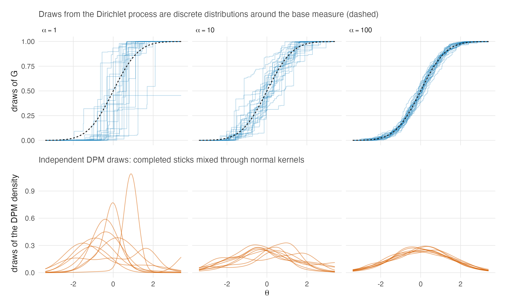

# The Dirichlet Process {#sec-ch15}

```{r}
#| label: setup-ch15
#| include: false
tbl <- function(id) readRDS(file.path("..", "..", "tables", paste0(id, ".rds")))
```

Reviewer 2 raised two specific objections to the manuscript's treatment of the Dirichlet
process: the parameter $\alpha$ is misnamed, and the Chinese restaurant process is
introduced with no stated connection to the process it is supposed to represent. Both are
symptoms of one thing — the DP treated as a black box — and this chapter opens the box.

It is the longest chapter in the book, and deliberately self-contained. A reader who
accepts @sec-ch14's conclusion that the DP's distinguishing feature is *not* what it can
represent but what it does not have to be told is entitled to see exactly what it is told
instead.

## Ferguson's definition {#sec-ch15-definition}

::: {#def-dp}
**The Dirichlet process.** *Restated from Ferguson (1973)*

Let $(\mathcal{X}, \mathcal{A})$ be a measurable space and $\alpha$ a **finite non-null
measure** on it. A stochastic process $P$ indexed by the elements of $\mathcal{A}$ is a
Dirichlet process with parameter $\alpha$ if for every measurable partition
$(A_1,\dots,A_k)$ of $\mathcal{X}$ the random vector $(P(A_1),\dots,P(A_k))$ has a
Dirichlet distribution with parameter $(\alpha(A_1),\dots,\alpha(A_k))$.
:::

Read the parameter carefully, because this is where R2's first objection is answered.
**Ferguson's $\alpha$ is a measure, not a number.** It carries two pieces of information at
once, and separating them is the whole of the terminology question:

$$
\alpha(\cdot) = \underbrace{\alpha(\mathcal{X})}_{\text{total mass}}
\;\times\;
\underbrace{\frac{\alpha(\cdot)}{\alpha(\mathcal{X})}}_{\text{base measure } G_0} .
$$ {#eq-dp-split}

The scalar $\alpha(\mathcal{X})$ is what modern usage calls **the concentration
parameter** — also the precision or mass parameter. The normalized measure $G_0$ is the
**base measure**, and it is the prior mean: $\operatorname{E}[P(A)] = G_0(A)$ for every
$A$. Writing "$\alpha$" for the scalar is standard and harmless as long as one remembers
that in Ferguson it names the whole measure; writing it while calling it something other
than a concentration is not, and @sec-ch15-concentration says exactly what it concentrates.

Ferguson's main theorem is conjugacy: if $X_1,\dots,X_n$ is a sample from $P$ and
$P \sim \mathrm{DP}(\alpha)$, then the posterior is
$\mathrm{DP}(\alpha + \sum_{i=1}^n \delta_{X_i})$, where $\delta_x$ gives mass one to $x$.
Every predictive statement below is a corollary of that one line.

## Three representations, and why they are the same object {#sec-ch15-representations}

The DP is usually met through one of three constructions, and a reader who meets only one
will find the others mysterious. @tbl-dp-representations lays them side by side.

```{r}
#| label: tbl-dp-representations
#| tbl-cap: "Four descriptions of one object, and what each makes visible. Source: tables/T-dp-representations.rds."
#| echo: false
knitr::kable(tbl("T-dp-representations"))
```

### Stick-breaking {#sec-ch15-stick}

::: {#thm-stick}
**Stick-breaking construction.** *Restated from Sethuraman (1994)*

Let $\theta_1,\theta_2,\dots$ be i.i.d. $\mathrm{Beta}(1, \alpha(\mathcal{X}))$ and
$Y_1,Y_2,\dots$ be i.i.d. $G_0$, independent of the $\theta$'s. Put

$$
p_1 = \theta_1, \qquad
p_n = \theta_n \prod_{m=1}^{n-1}(1-\theta_m), \qquad
P = \sum_{n=1}^{\infty} p_n \delta_{Y_n} .
$$ {#eq-stick}

Then $\sum_n p_n = 1$ almost surely and $P$ is a Dirichlet process with parameter
$\alpha$.
:::

Sethuraman's paper is a self-contained proof that @eq-stick has the Dirichlet
finite-dimensional marginals (his Theorem 3.4) and the conjugacy property (his Theorem
4.3). The construction is worth more than its proof, because it makes two things visible
that Ferguson's definition conceals.

The first is **almost-sure discreteness**: @eq-stick is a countable sum of point masses,
so a DP draw is a discrete distribution with probability one. Ferguson gives a separate
constructive definition in his § 4 that also shows this, but as Sethuraman notes, "it takes
some effort to see that the two definitions are equivalent."

The second is the **size of the atoms**, which @sec-ch15-elicitation shows is the quantity
that elicitation silently determines.

::: {#prp-discrete}
**A DP draw is discrete.** *Restated; immediate from @thm-stick*

$P \sim \mathrm{DP}(\alpha)$ puts probability one on the set of discrete probability
measures on $\mathcal{X}$.
:::

This is a fatal defect if the DP is used directly as a prior for a continuous latent
trait, and @sec-ch15-mixtures is the repair.

### The Pólya urn and the restaurant {#sec-ch15-crp}

::: {#thm-crp}
**CRP–DP correspondence.** *Restated from Blackwell and MacQueen (1973)*

Call $\{X_n\}$ a **Pólya sequence** with parameter $\alpha$ if each $X_n$ is drawn from
the normalized measure $\alpha + \sum_{i<n}\delta_{X_i}$. Then the empirical distribution
of colours after $n$ draws converges as $n \to \infty$ to a limiting **discrete**
distribution $P$; the law of $P$ is Ferguson's Dirichlet process with parameter $\alpha$;
and given $P$, the draws $X_1, X_2, \dots$ are independent with distribution $P$.
:::

This is the theorem R2 asked for, and it says precisely what the connection is. The
Chinese restaurant process is not a separate model, an approximation, or a heuristic. It is
**the exchangeable partition structure of a Pólya sequence**, and a Pólya sequence is what
a Dirichlet process looks like once the random measure has been integrated out.

Concretely: since $\alpha = \alpha(\mathcal{X})G_0$ and $G_0$ is nonatomic here, a draw from the
normalized $\alpha + \sum_{i<n}\delta_{X_i}$ is a repeat of an earlier value with
probability proportional to how many times that value has already occurred, and a fresh
draw from $G_0$ with probability proportional to $\alpha(\mathcal{X})$. Rename the distinct
values "tables" and the observations "customers" and that sentence is the restaurant. The
metaphor adds nothing and hides the measure, which is why introducing it first — as the
manuscript does — invites exactly the objection R2 raised.

## What $\alpha(\mathcal{X})$ concentrates {#sec-ch15-concentration}

Antoniak [-@antoniak_mixtures_1974, § 4, pp. 1160–1163] works out the consequence of the
predictive rule.
Let $W_i = 1$ if the $i$-th draw is a new distinct value. Then

$$
\Pr(W_i = 1) = \frac{\alpha(\Theta)}{\alpha(\Theta) + i - 1},
$$ {#eq-newtable}

and $Z_n = \sum_{i \le n} W_i$ is the number of distinct values in the first $n$ draws.
Antoniak draws the conclusion that settles the naming question: the rate at which new
distinct values appear "depends only on the magnitude of $\alpha(\Theta)$, and not the
shape of $\alpha(\cdot)$," while the distinct values themselves are distributed as
$G_0 = \alpha(\cdot)/\alpha(\Theta)$.

**The two arguments of the DP therefore do disjoint jobs.** $G_0$ says where atoms fall;
$\alpha(\mathcal{X})$ says how many there are. Calling the second a concentration parameter
is not a convention — it is a description.

::: {#thm-antoniak}
**The distribution of the number of clusters.** *Restated from Antoniak (1974)*

If $G_0$ is nonatomic, let $K_J$ be the number of distinct values among $J$ draws. More
generally the same formulas count occupied CRP tables, which need not equal distinct values
when $G_0$ has atoms.

$$
\Pr(K_J = k) = \frac{|s(J,k)|\,\alpha(\mathcal{X})^k}
                    {\alpha(\mathcal{X})\,(\alpha(\mathcal{X})+1)\cdots(\alpha(\mathcal{X})+J-1)},
$$ {#eq-antoniak-pmf}

where $|s(J,k)|$ are unsigned Stirling numbers of the first kind, and

$$
\operatorname{E}[K_J] = \sum_{m=1}^{J}\frac{\alpha(\mathcal{X})}{\alpha(\mathcal{X})+m-1}
= \alpha(\mathcal{X})\{\psi(\alpha(\mathcal{X})+J) - \psi(\alpha(\mathcal{X}))\}
\;\approx\; \alpha(\mathcal{X})\log\!\frac{J + \alpha(\mathcal{X})}{\alpha(\mathcal{X})} .
$$ {#eq-antoniak-mean}

Moreover $K_J$ is sufficient for $\alpha(\mathcal{X})$.
:::

*Proof of the closed form.* Antoniak gives the sum and the logarithmic approximation
directly. The digamma expression follows because $\sum_{m=1}^{J} (\alpha+m-1)^{-1} =
\psi(\alpha+J) - \psi(\alpha)$. The pmf and its mean are checked numerically in
`code/R/15-derivation-checks.R`. ∎

Two consequences carry into the design of any application.

**The number of clusters grows like $\log J$, not like $J$.** From
@eq-antoniak-mean, ten times as many people buys only about $2.3\,\alpha(\mathcal{X})$ more
clusters. A DP is a *parsimony* prior, which is easy to miss when it is described as
"infinite-dimensional."

**$\alpha$ is a strong statement, not a vague one.** At $J = 200$ and
$\alpha(\mathcal{X}) = 1$, @eq-antoniak-pmf puts a central 95% interval of $[2, 10]$ on
$K_J$. Choosing $\alpha$ is choosing a fairly tight prior on the number of subpopulations,
and @fig-k-alpha shows both facts.

![Antoniak's distribution of the number of occupied clusters. **Left:** the exact prior pmf of $K_J$ at $J = 200$, computed from unsigned Stirling numbers of the first kind, for three concentrations. The distribution is tight — at $\alpha = 1$ almost all the mass lies between 2 and 10, a central 95\% interval — so $\alpha$ is a strong statement, not a vague one. **Right:** $\operatorname{E}[K_J] = \alpha\{\psi(\alpha+J)-\psi(\alpha)\}$ against $J$ on a logarithmic axis, where the curves are straight: the number of clusters grows like $\alpha\log J$, so ten times the data buys only $\alpha\log 10 \approx 2.3\alpha$ more clusters. Deterministic; no simulation. Generated by code/R/09-figures.R.](../figures/F-k-alpha.png){#fig-k-alpha}

## From a discrete draw to a continuous $G$ {#sec-ch15-mixtures}

@prp-discrete rules out the raw DP as a prior for a latent trait: abilities are continuous,
and a prior that puts probability one on discrete distributions would force ties between
people who are not tied.

Lo [-@lo_class_1984] supplies the step that makes the DP usable. Given a positive
normalized kernel $K(x,u)$ and a finite measure $\alpha$, he constructs a random density by
**convolving the kernel with a Dirichlet random probability**:

$$
f(x \mid G) = \int K(x,u)\, G(du), \qquad G \sim \mathrm{DP}(\alpha) ,
$$ {#eq-dpm}

classifies the posterior of the random density given a sample, and gives the Bayes
estimator under squared-error loss. Because $G$ is discrete, @eq-dpm is a *countable
mixture* — under a normal kernel, a countable mixture of normals with weights from
@eq-stick and locations from $G_0$ — and it is continuous whenever $K$ is.

This is the object the rest of the book means by "a DPM prior on $G$," and its two-line
description is worth stating once cleanly. **The Dirichlet process supplies the weights and
the locations; the kernel supplies the smoothness.** Lo notes the no-sample Bayes estimator
is $\int K(x,u)\,G_0(du)$, the base measure convolved with the kernel — so with a normal
kernel and a normal $G_0$, the prior mean of the density is itself normal. A DPM prior is
therefore *centred on* the parametric model it generalizes, which is the cleanest possible
answer to a reader who asks what is lost if the truth is normal after all. Centred on is
the right phrase and the only right phrase: the normal is the prior *mean*, and normality
sits in the support, but no draw from the prior is exactly normal and the DPM is not a
model that "contains" the normal model as a fitted special case — a distinction that
matters when results under the two priors are compared, and that @sec-ch16 keeps.

@fig-dp-draws shows both halves of the construction at once — draws of the discrete $G$
at three concentrations, and the continuous densities the kernel makes of them.

::: {#fig-dp-draws}



:::

## Computation, briefly {#sec-ch15-computation}

Two families of algorithm implement @eq-dpm, and the difference is which representation
they exploit.

**Marginal (collapsed) samplers** integrate $G$ out and work with the Pólya urn predictive
rule of @thm-crp, updating cluster memberships one at a time. Neal
[-@neal_markov_2000] is the standard catalogue, including the algorithms that handle
non-conjugate kernels. **Blocked samplers** truncate @eq-stick at a finite number of
components and sample the weights and locations directly; Ishwaran and Zarepour
[-@ishwaran_markov_2000] study the approximation error this truncation incurs.

The companion package uses NIMBLE, whose DP machinery is CRP-based, and the details are
Appendix F's. The point for here is that the choice is a choice between the two
representations of @sec-ch15-representations and has no inferential content.

## Choosing $\alpha$ is not a technicality {#sec-ch15-elicitation}

Everything above treats $\alpha(\mathcal{X})$ as given. In practice it is either fixed or
given a hyperprior, and individual papers often compare several overlapping strategies.
@tbl-alpha-elicitation therefore reports seven source-specific contributions rather than
forcing each paper into one exclusive “stance.”

```{r}
#| label: tbl-alpha-elicitation
#| tbl-cap: "Seven source-specific contributions to concentration-parameter elicitation. Rows are not mutually exclusive. Source: tables/T-alpha-elicitation.rds."
#| echo: false
knitr::kable(tbl("T-alpha-elicitation"))
```

The sources differ in both target and method. Paganin et al. examine the induced mean and
variance of $K_N$ and use different Gamma priors in their simulation and real-data
analyses; they do not advocate one universal reproducibility prior. Antonelli et al.
[-@antonelli_mitigating_2016] compare moment matching, diffuse Gamma, Kullback--Leibler,
fixed-$\alpha$, empirical-Bayes and importance-sampling strategies. Lee et al.
[-@lee_improving_2025] elicit an entire distribution for $K$ through a chi-square
construction and fit a Gamma hyperprior by Dorazio's KL method, rather than matching only
$\operatorname{E}[K_J]$. Murugiah and Sweeting [-@murugiah_selecting_2012] develop a
selection framework both with and without subjective information and provide defaults.
Dorazio [-@dorazio_selecting_2009] and Rodríguez [-@rodriguez_jeffreys_2013] supply
induced-cluster and objective routes; Rodríguez's Ewens Jeffreys prior is proper but has
**no finite moments**. Vicentini and Jermyn [-@vicentini_prior_2025] pose the current
question: specify $p(\alpha\mid\eta)$ through quantities for which “meaningful” prior
information can actually be expressed. The design-conditional framework of this
research programme is one answer to that question posed as a procedure: state a belief
about the number of occupied clusters at the design's own $J$, convert it into a Gamma
hyperprior on $\alpha$ by two-stage moment matching, and — the step the next subsection
motivates — anchor the induced weight behaviour at the same time
[@lee_design-conditional_2026]. The `DPprior` package implements the framework, and it
is the machinery behind the companion simulation's "focused" and "broad" elicitation
arms [@lee_dpprior_2026].

### The unintended prior {#sec-ch15-unintended}

Vicentini and Jermyn's framing points at a phenomenon that is easy to demonstrate and easy
to miss. **Matching one induced quantity leaves the others unconstrained, and they can come
out extreme.**

Take the most defensible elicitation in the table — matching $\operatorname{E}[K_J]$ to an
expert's cluster count. At $J = 200$ and a target of five clusters, @eq-antoniak-mean gives
$\alpha(\mathcal{X}) = 0.80$. Now ask what that same prior says about the *largest* stick
weight in @eq-stick. The answer, computed in @fig-stick-crp, is that its median is
$0.66$ and it exceeds $0.5$ with prior probability $0.76$.

An analyst who said "I expect about five subpopulations" has therefore also said, without
being asked and without noticing, that there is about a 76% chance one subpopulation
contains more than half of everybody. At a target of three clusters the median largest
weight is $0.86$.

![**Left:** stick-breaking weights $p_n = \theta_n\prod_{m<n}(1-\theta_m)$ with $\theta_m \sim \mathrm{Beta}(1,\alpha)$, sorted, at three concentrations. Small $\alpha$ concentrates the population into few components; large $\alpha$ spreads it. **Right:** the prior this induces on the *largest* weight, at concentrations chosen so that $\operatorname{E}[K_{200}]$ equals 3, 5 and 10 — the quantity an analyst usually elicits. Matching $\operatorname{E}[K_{200}] = 5$ requires $\alpha = 0.80$, under which the largest component holds a median $66\%$ of the population and exceeds half of it with prior probability $0.76$. Eliciting a cluster count is therefore also, silently, an assertion about dominance. Seed fixed; illustrative. Generated by code/R/09-figures.R.](../figures/F-stick-crp.png){#fig-stick-crp}

This is not this book's discovery and should not be presented as one. It is a known problem
with a literature. Greve et al. [-@greve_spying_2022] identify precisely this as "a major
empirical challenge" — characterizing the prior a flexible cluster-count specification
induces on the partition — and provide tools for inspecting it. Giordano et al.
[-@giordano_evaluating_2022] make the complementary point that because these models are so
flexible "the consequences of prior choices can be opaque," while prior choice "can have a
substantial effect on posterior inferences," and give a method for quantifying sensitivity
to the stick-breaking prior specifically.

The natural repair, once the phenomenon is named, is to elicit *both* quantities at
once — and that is exactly what the dual-anchor protocol of the design-conditional
framework does. One anchor pins the expected cluster count; the second pins the prior
probability that the largest weight exceeds a stated threshold, the very quantity
@fig-stick-crp computes and the analyst never meant to assert; the Gamma hyperprior is
then chosen to respect both, with the trade between them made explicit when they
conflict [@lee_design-conditional_2026]. The implementation exposes the induced
quantity directly — the package function that returns
$\Pr(p_{(1)} > t)$ exists precisely so the silent assertion of
@sec-ch15-unintended can be read before it is made [@lee_dpprior_2026]. The paper is
held here only at abstract-and-framework level, so this chapter uses it for the
protocol's stated design and does not import its simulation findings.

The honest summary is that the DP removes the requirement to name a component count and
replaces it with a requirement to name a concentration, and that the second choice has more
consequences than the first advertises. That is still a gain — a posterior over $K$ is
worth having, and @sec-ch14 explains why; the elicitation machinery above exists to make
the trade an informed one rather than an escape.

Miller and Harrison [-@miller_mixture_2018] name the alternative: put a prior directly on
the number of components in a finite mixture, which makes the cluster-count prior explicit
rather than induced. @sec-ch14 is where that comparison belongs, and nothing in this
chapter argues that the DP is the only defensible choice.

## Sources and provenance {#sec-ch15-sources}

@def-dp is Ferguson [-@ferguson_bayesian_1973], read directly, from his § 1 summary and § 3;
the conjugacy theorem and the description of $\alpha$ as a finite non-null measure are his
words. @eq-dp-split is the standard decomposition and is stated here because the
measure-versus-scalar distinction is exactly what R2's objection turns on.

@thm-stick is Sethuraman [-@sethuraman_constructive_1994], read directly: the
$\mathrm{Beta}(1,\alpha(\mathcal{X}))$ sticks, the product form, the almost-sure summation
to one, and his Theorems 3.4 and 4.3 establishing the Dirichlet marginals and conjugacy.
The remark that the equivalence with Ferguson's § 4 construction "takes some effort to see"
is his.

@thm-crp is Blackwell and MacQueen [-@blackwell_ferguson_1973], read directly from their
abstract and § 1: the extended Pólya urn with a continuum of colours, convergence to a
limiting discrete $\mu^*$, the identification of its law with Ferguson's, and conditional
independence given $\mu^*$. The reduction of the restaurant metaphor to that theorem is
this book's presentation, not theirs, and it is the answer to R2-4b.

@thm-antoniak and @eq-newtable are Antoniak
[-@antoniak_mixtures_1974, § 4, pp. 1160–1163], read directly:
the new-value probability, the sum for $\operatorname{E}(Z_n)$, the logarithmic
approximation, the Stirling-number pmf, and the sufficiency of $Z_n$ for $\alpha(\Theta)$.
The digamma closed form is one line from his sum and is checked numerically rather than
taken on trust. The remark that this makes $\alpha$ a *parsimony* prior is this book's
reading.

@eq-dpm is Lo [-@lo_class_1984, § 2], read directly, including the no-sample Bayes estimator
$\int K(x,u)\,G_0(du)$ from which the "centred on the parametric model" observation follows.

Computation follows Neal [-@neal_markov_2000] and Ishwaran and Zarepour
[-@ishwaran_markov_2000] at the level of what each family of algorithm does; no algorithm is
reproduced here and none of the book's claims depends on the details.

The seven source-specific elicitation contributions are read at the level of each work's
stated aim and summary of the problem; the rows are explicitly nonexclusive. Rodríguez's
[-@rodriguez_jeffreys_2013] result that the Ewens Jeffreys prior is proper with no finite
moments is from his abstract and is quoted because it is the kind of property that is
easy to adopt a prior without knowing. The seventh row and the dual-anchor paragraph
cite this programme's design-conditional elicitation paper at the level of its abstract
and stated framework [-@lee_design-conditional_2026] and its implementation
[-@lee_dpprior_2026], read from the package source and documentation. No substantive
simulation finding from the held paper is used as evidence in this chapter.

@fig-k-alpha is computed exactly from @eq-antoniak-pmf on the log scale. @fig-stick-crp's
right panel is simulated from @eq-stick with a fixed seed; the medians and exceedance
probabilities quoted in @sec-ch15-unintended are from that simulation and are Monte Carlo
estimates, not exact values. @fig-dp-draws is simulated from @eq-stick and @eq-dpm with
a fixed seed and finite truncation, added in this edition
(`code/R/23-figures-v2-theory.R`); it illustrates the objects and asserts nothing. The generated values are frozen in
`tables/F-stick-crp-summary.rds` with a CSV mirror in `tables/supplement/`. The
phenomenon they illustrate is Greve et al.'s
[-@greve_spying_2022] and Giordano et al.'s [-@giordano_evaluating_2022], and is presented
as theirs.
