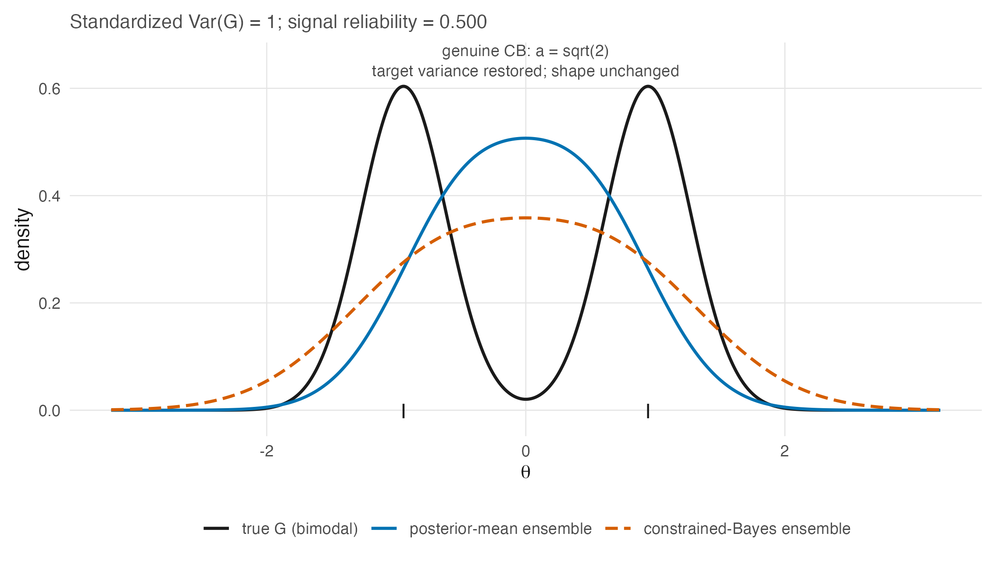

# Constrained Bayes {#sec-ch18}

```{r}
#| label: setup-ch18
#| include: false
ens_summary <- readRDS(file.path("..", "..", "tables", "F-ensemble-shrink-summary.rds"))
ens_metric <- function(id) ens_summary$value[match(id, ens_summary$metric)]
```

@sec-ch17 established that the three goals have different Bayes actions. This chapter takes
the first repair — the one that fixes the ensemble's spread — and states both what it
achieves and, more usefully, the exact boundary of what it cannot.

The boundary turns out to be sharp and to follow from one structural fact: **constrained
Bayes is a positive affine map of the posterior means.** Everything the chapter concludes
about its limits is a consequence of that sentence.

## The problem, restated as a constraint {#sec-ch18-problem}

@prp-underdispersion gave the defect: the posterior-mean ensemble has variance
$\sigma^2_\theta - \operatorname{E}[\operatorname{Var}(\theta_p \mid \mathbf{u}_p)]$, below
the truth. Louis [-@louis_estimating_1984] proposed fixing it by **matching moments** —
requiring the ensemble of estimates to have the mean and variance the parameter ensemble is
posteriorly expected to have — and Ghosh [-@ghosh_constrained_1992] generalized the
construction and gave it its name.

Ghosh's summary of the motivation is worth quoting because it names the decision rather
than the statistic: often "the main objective is to produce an ensemble of parameter
estimates whose histogram is in some sense close to the histogram of population
parameters," as in "subgroup analysis, where the problem is not only to estimate the
different components of a parameter vector, but also to identify the parameters that are
above, and the others that are below" a threshold. That is @sec-ch17-distribution's goal,
and it is the cut-score problem @sec-ch01 opened with.

## The estimator {#sec-ch18-estimator}

Write $\eta_p = \operatorname{E}[\theta_p \mid \mathbf{u}]$ and $v_p =
\operatorname{Var}[\theta_p \mid \mathbf{u}]$, with $\bar\eta$, $\bar v$ their averages
over the $P$ persons and $V_\eta = P^{-1}\sum_p (\eta_p - \bar\eta)^2$.
The source literature writes the posterior variance with a person-indexed lambda; TD-3
requires $v_p$ here because $\lambda_i$ already denotes 2PL item discrimination throughout
the book.

::: {#thm-cb}
**The constrained Bayes estimator.** *Adapted from Ghosh (1992, Theorem 1); the
independent-posterior specialization is derived here*

Among actions whose ensemble mean and variance match the posterior expectations of the
parameter ensemble's mean and variance, the one minimizing posterior expected squared
error is

$$
\theta^{\mathrm{CB}}_p = \bar\eta + a\,(\eta_p - \bar\eta),
\qquad
a = \sqrt{1 + \frac{H_1}{H_2}},
$$ {#eq-cb}

where $H_1 = \operatorname{tr}\{\operatorname{V}(\boldsymbol\theta - \bar\theta\mathbf{1}
\mid \mathbf{u})\}$ and $H_2 = \sum_p (\eta_p - \bar\eta)^2$. Under posterior independence
this is

$$
a = \sqrt{1 + \left(1 - \tfrac1P\right)\frac{\bar v}{V_\eta}} .
$$ {#eq-cb-a}
:::

The inflation factor is the chapter's whole content, and @eq-cb-a says where it comes from.
The denominator $V_\eta$ is the spread the posterior means *have*; the numerator
$\bar v$ is the spread they are *missing*, because @prp-underdispersion says the
posterior means give up exactly the average posterior variance. So $a$ is the factor that
puts back what shrinkage removed, and

$$
\widehat{\operatorname{Var}}[G_P] = V_\eta + \left(1-\tfrac1P\right)\bar v
$$ {#eq-cb-decomp}

is the posterior expected empirical-distribution variance of the realized
abilities when variance is defined with divisor $P$ — the target @eq-cb matches
by construction.

Two details are worth stating precisely because denominator conventions and
posterior dependence can otherwise obscure them.

**When $H_1>0$ and $H_2>0$, $a > 1$, so this is inflation and not shrinkage.** Ghosh flags
the misreading himself under those conditions: @eq-cb "has the deceptive appearance of expressing the components of
$\mathbf{e}^{\mathrm{CB}}$ as convex combinations of the Bayes estimates and their
averages. This is not so, because $a > 1$." The CB estimate of a person above the mean is
*further* above it than their posterior mean, and further from the data than the posterior
mean is only in the direction the posterior mean over-corrected. If $H_1=0$, then $a=1$;
if $H_2=0<H_1$, the displayed rule is undefined rather than an inflation factor.

**The finite-$P$ factor is already present when denominator conventions are aligned.**
@eq-cb-a defines $V_\eta$ with divisor $P$. R's `var(theta_pm)`, however, is the sample
variance with divisor $P-1$:

$$
s_\eta^2
= \frac{1}{P-1}\sum_p(\eta_p-\bar\eta)^2
= \frac{P}{P-1}V_\eta.
$$

It follows exactly that

$$
\sqrt{1+\frac{\bar v}{s_\eta^2}}
=\sqrt{1+\left(1-\frac1P\right)\frac{\bar v}{V_\eta}}.
$$

Thus a formula written as $\sqrt{1+\bar v/\operatorname{var}(\boldsymbol\eta)}$
has not dropped the factor when `var` means the divisor-$(P-1)$ sample variance.

The companion package implements precisely this identity. In `.triple_goal()` it forms
`theta_pm <- colMeans(s)`, obtains the marginal posterior variances as
`lambda_k <- theta_psd^2`, sets `var_pm <- var(theta_pm)`, and then computes
`cb_factor <- sqrt(1 + mean(lambda_k) / var_pm)` [@lee_dpmirt_2026,
`R/estimates.R`, `.triple_goal()` lines 264--296, specifically lines 272, 281,
284, and 296]. Because `var_pm` has divisor $P-1$, this is
algebraically identical to @eq-cb-a under posterior independence, at finite $P$;
it is not a large-$P$ approximation.

The remaining limitation is cross-person posterior covariance. Writing $v_p$
for the marginal posterior variances, Ghosh's numerator expands as

$$
H_1
=\left(1-\frac1P\right)\sum_p v_p
-\frac{2}{P}\sum_{p<q}\operatorname{Cov}(\theta_p,\theta_q\mid\mathbf u).
$$

The package expression uses the first term and omits the second. That omission vanishes
under posterior independence, but a joint IRT fit can induce dependence through shared
item parameters and hyperparameters. Its magnitude and sign are not evaluated here, so
"CB attains the target variance" remains conditional on the independent-posterior
specialization (or on a zero aggregate off-diagonal covariance term).

**CB can fail to exist.** Ghosh's Remark 2 notes that $H_2$ may be zero with positive
probability — all posterior means equal — in which case @eq-cb is undefined. In the Rasch
setting this happens when every person attains the same total score, which is rare but not
impossible on a short test with a homogeneous group.

## What CB cannot do, and why {#sec-ch18-limits}

@eq-cb is an affine function of $\eta_p$ with positive slope. That single fact settles
several questions at once, and stating it as a proposition is better than discovering each
consequence separately.

::: {#prp-cb-affine}
**CB changes location and scale and nothing else.** *Adapted from Shen and Louis (1998,
§ 3, p. 459) for ranks; the standardized-moment statement is derived here*

Because $\theta^{\mathrm{CB}}_p = \bar\eta + a(\eta_p - \bar\eta)$ with $a > 0$:

1. the **ordering** of the CB estimates is the ordering of the posterior means, exactly;
2. every **standardized moment of order $\ge 3$** of the CB ensemble equals that of the
   posterior-mean ensemble — skewness, kurtosis, and every higher shape feature are
   inherited unchanged;
3. consequently the **shape** of the recovered distribution is the shape of the
   posterior-mean ensemble, rescaled.
:::

*Proof.* An affine map $x \mapsto b + ax$ with $a > 0$ is strictly increasing, giving (1).
For (2), standardized moments $\operatorname{E}[(X-\mu)^k]/\sigma^k$ are invariant under
positive affine maps for every $k$. (3) is (2) restated. ∎

Shen and Louis [-@shen_triple-goal_1998, § 3, p. 459] state the rank case directly: "the ranks
based on the CB estimates are always identical with the ranks based on the posterior
means." @prp-cb-affine says that is not a coincidence about ranks but an instance of a
wider invariance.

The consequence that matters for this book is item 2. **CB cannot repair a shape mismatch
already present in the posterior-mean ensemble**, because a positive affine map has no
access to shape beyond location and scale. This does not say that CB can never reproduce a
bimodal target: it can do so when the posterior-mean ensemble already has that shape up to
an affine transformation, including a sufficiently informative limiting regime.
@fig-ensemble-shrink, whose right-hand panel exists for this chapter, shows one finite-design
failure: under a sharply bimodal truth with excess kurtosis
`r sprintf("%.2f", ens_metric("true_excess_kurtosis"))`, CB restores the standard deviation
to `r sprintf("%.2f", ens_metric("cb_sd"))` and leaves the excess kurtosis at the posterior
means' `r sprintf("%.2f", ens_metric("posterior_mean_excess_kurtosis"))`. The valley stays
filled in; only the axis is stretched.

The same failure can be drawn without simulating anyone. @fig-cb-affine works entirely
in closed form under the constant-error working model at the 0.5 reliability tier —
the tier where, per @eq-underdisp-exact, the compression is severest — and shows the
posterior-mean ensemble arriving unimodal, so that no positive affine map of it can
reach the two-moded truth.

::: {#fig-cb-affine}



:::

This is exactly why @sec-ch19 exists. If the goal is the EDF and the truth is not
determined by two moments, a moment-matching repair is structurally insufficient and a
different construction is required.

::: {.callout-note appearance="simple"}
::: {.ms}
**CB still helps, and saying otherwise would overcorrect.** In the same simulation the
Kolmogorov–Smirnov distance to the true EDF falls from
`r sprintf("%.2f", ens_metric("ks_posterior_mean"))` for the posterior means to
`r sprintf("%.2f", ens_metric("ks_cb"))` for CB. Fixing the variance is a real improvement even when the shape is wrong, and
the honest summary is that CB removes the part of the error that a scale correction can
remove. Note also that in this particular configuration the raw ML ensemble happens to
score `r sprintf("%.2f", ens_metric("ks_ml"))` — better than CB — which is a reminder that a single KS number at one error
variance is not a ranking of estimators. @sec-ch19 compares them on the loss they are
actually built for.
:::
:::

## Where CB sits {#sec-ch18-relation}

CB belongs to a family of variance-inflation repairs, and its distinguishing feature is
that the inflation factor is *derived from the posterior* rather than tuned.

The comparison with @sec-ch12's Louis observation makes this concrete. Louis's
approximate prescription — weight the data by roughly the square root of the
posterior-mean weight — and @eq-cb-a are the same idea at different levels of exactness:
under the constant-error normal working model of @prp-underdispersion, the two coincide,
because there $V_\eta = \bar w^2(\sigma^2_\theta + \operatorname{se}^2)$ and
$\bar v = \bar w\operatorname{se}^2$, so $a \to \bar w^{-1/2}$ and
$a\eta_p = \sqrt{\bar w}\,\hat\theta_p$ up to the centring. @sec-ch12's square root and
@eq-cb are one estimator.

Beyond CB, the line of work that relaxes the Gaussian assumption on $G$ runs through
Paddock et al. [-@paddock_flexible_2006]. Their § 2 places CB in the same lineage this
chapter does — "Louis (1984) and Ghosh (1992) developed constrained Bayes estimates that
provide unit-specific estimates with an empirical distribution" matching the target
moments — and their contribution is to ask what happens when the *population* distribution
is itself misspecified rather than merely under-dispersed.

Their answer bears directly on this book's design. Among their data-generating
distributions is a bimodal Gaussian mixture, and they find that a nonparametric population
model "pays very little in efficiency when a parametric population distribution" would have
sufficed, while a parametric one can be badly wrong for the EDF when it does not. But they
also report a result that does not flatter every flexible procedure: under a bimodal truth
with informative data, their **DP-1** and smoothing-by-roughening fits attain lower
squared-error loss for the $\theta$s yet **larger** ISEL for $G$ than the Gaussian and
$T_5$ choices [-@paddock_flexible_2006, § 4.2.2.1]. Their DP-2 fit lowers both losses in
the same condition, so this is a procedure-specific trade-off rather than a generic
property of Dirichlet-process or nonparametric models.

## Sources and provenance {#sec-ch18-sources}

@thm-cb is adapted from Ghosh [-@ghosh_constrained_1992, Theorem 1], read directly, together with his
definitions of $H_1$ and $H_2$ and the derivation of $a = [1 + H_1/H_2]^{1/2}$ in his
proof. Remark 1's warning that $a > 1$ under the theorem's positive-dispersion conditions
and Remark 2's non-existence case are his and are quoted because both are routinely omitted
from applied restatements. Ghosh credits Louis
[-@louis_estimating_1984] with formalizing the moment-matching idea, and this book follows
that attribution.

The per-unit form @eq-cb-a and @eq-cb-decomp are algebra from Ghosh's $H_1$ and $H_2$
under posterior independence; they are checked numerically in
`code/R/15-derivation-checks.R` rather than asserted. The equality between that form and
the package expression follows from the divisor-$(P-1)$ definition of R's
`var(theta_pm)`, displayed explicitly in @sec-ch18-estimator.

@prp-cb-affine is adapted and splits its provenance. The rank case is Shen and Louis
[-@shen_triple-goal_1998, § 3, p. 459], quoted. The generalization to all standardized moments of
order $\ge 3$ is elementary and derived here; it is stated as a proposition rather than
left implicit because it is the reason @sec-ch19 is a separate chapter rather than a
refinement of this one.

The right-hand panel of @fig-ensemble-shrink and the KS numbers in @sec-ch18-limits are
computed in `code/R/09-figures.R` with fixed seeds, frozen in
`tables/F-ensemble-shrink-summary.rds` with a CSV mirror, and read by this chapter. The ML
comparison is reported because it does not flatter the argument.

Paddock et al. [-@paddock_flexible_2006] is now held and was read for §§ 1, 2, 4.2.2 and
6; its identifiers come from the source's own embedded record and confirm those previously
taken from Lin et al.'s [-@lin_loss_2006] reference list. Its § 2 supplies the Louis–Ghosh
lineage quoted above and its § 4.2.2.1 the finding that flexibility can cost ISEL even
where it gains SEL, which is included because it complicates rather than supports this
book's preference.

The package sequence and its denominator convention are read directly from
`.triple_goal()` in `R/estimates.R` (lines 264--296): `theta_pm` at line 272,
`lambda_k` at line 281, `var_pm <- var(theta_pm)` at line 284, and `cb_factor`
at line 296
[@lee_dpmirt_2026]. The matching receipt records both the finite-$P$ equivalence and the
unresolved covariance omission. @fig-cb-affine is closed-form algebra under the working
model, added in this edition (`code/R/23-figures-v2-theory.R`); nothing is simulated in it
and nothing rests on it beyond what @prp-cb-affine already establishes.
