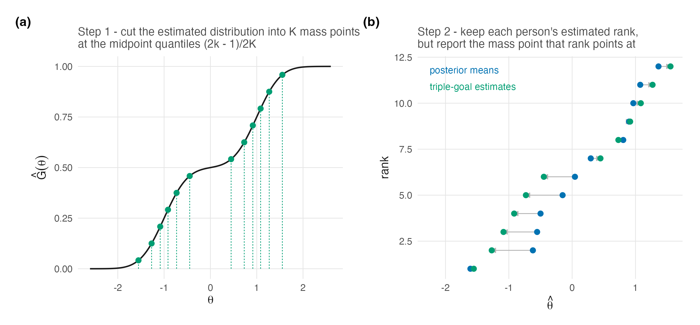

# Triple-Goal Estimation {#sec-ch19}

```{r}
#| label: setup-ch19
#| include: false
tbl <- function(id) readRDS(file.path("..", "..", "tables", paste0(id, ".rds")))
```

@sec-ch18 showed that a moment-matching repair cannot reach shape, because it is an affine
map. This chapter is the construction that can, and it works by giving up on finding a
single optimum: rather than looking for one vector that minimizes three losses,
Shen and Louis [-@shen_triple-goal_1998] estimate the **distribution** and the **ranks**
separately and then assemble person estimates from the two.

The chapter also resolves, completely, the ambiguity Reviewer 1 reported. @sec-ch17 named
$G_N$ as the realized EDF; here the quantity the manuscript actually computes,
$\bar G_N(t)$, is exhibited and shown to be a **cumulative probability** — which is why it
looks like neither a rank nor a trait estimate, because it is neither.

## What $\bar G_N(t)$ is {#sec-ch19-gbar}

Start with the object, because everything else is built from it. Shen and Louis's § 2.3
defines ISEL in their equation (3) and then defines its posterior target

$$
\bar G_K(t) = \operatorname{E}[G_K(t) \mid \mathbf{Y}]
= \frac{1}{K}\sum_{k} \Pr(\theta_k \le t \mid Y_k),
$$ {#eq-gbar}

the posterior expectation of the realized EDF @eq-edf-target. For each fixed $t$ it is an
**average of $K$ posterior probabilities**, hence a number in $[0,1]$, and as $t$ varies it
traces a distribution function on the trait scale.

::: {.callout-important}
## R1's confusion, resolved with a number

Reviewer 1 could not tell whether $G_N(t)$ was "a rank estimate or a latent trait
estimate," observing that "it appears to be a mean probability of some type but then the
authors describe it as a latent trait estimate."

**The reviewer's reading is correct and the manuscript's description is not.**
$\bar G_N(t)$ *is* a mean probability — @eq-gbar says so explicitly — and it is not a
latent trait estimate. In @fig-three-goals, computed for eight units,
$\bar G_K(0) = 0.476$: the estimated proportion of those eight people whose ability lies
below zero. It is on the probability axis, not the trait axis.

What *is* on the trait axis are the mass points $\hat U_j$ obtained by inverting it, and
the person estimates assembled from them. The manuscript conflates the function with its
inverse's values, which is a presentational defect and not a modelling one, and one
sentence fixes it: **$\bar G_N$ is the estimated EDF; $\hat U_j = \bar G_N^{-1}\{(2j-1)/2N\}$
are the trait values; $\theta^{\mathrm{GR}}_p = \hat U_{\hat R_p}$ is the person estimate.**
:::

## The construction {#sec-ch19-construction}

::: {#thm-gr}
**The triple-goal (GR) estimator.** *Restated from Shen and Louis (1998, §§ 2.1,
2.3--2.4, pp. 457--459)*

1. **Estimate the distribution.** Minimize posterior expected ISEL over discrete actions
   with at most $K$ mass points. The minimizer $\hat G_K$ puts mass $1/K$ at

   $$
   \hat U_j = \bar G_K^{-1}\!\left(\frac{2j-1}{2K}\right), \qquad j = 1,\dots,K .
   $$ {#eq-uhat}

2. **Estimate the ranks.** Minimize a squared-error loss on ranks, giving the discretized
   posterior ranks $\hat R_k$.

3. **Assemble.** Set $\hat\theta_k = \hat U_{\hat R_k}$.

@fig-gr-pipeline draws the two moves on a small worked example — the distribution cut
into its midpoint-quantile mass points, then the persons routed onto those points by
rank.

::: {#fig-gr-pipeline}



:::
:::

Step 2 needs a convention when expected ranks tie. A discrete Rasch test can make tied
scores—and therefore identical posteriors and expected ranks—unavoidable. Any permutation
within an exact tied block has the same squared rank loss and preserves the step-1 EDF, but
assigning distinct mass points by input row order would break exchangeability. The
theoretical GR action used here therefore randomizes uniformly over the loss-equivalent
permutations within each exact tie block. A deterministic display may use a stable
refinement only after verifying that its expected ranks are distinct; the worked example
below passes that check.

The estimator is named for its first two steps — $G$ and $R$ — and that naming is exact
rather than modest. Step 3 does not optimize anything for the individual; it distributes
the mass points that step 1 produced onto the people that step 2 ordered.

There is a conditional sense in which GR need not ignore coordinate squared error. Given
the mass points, the permutation minimizing
$\sum_k (\hat U_{z_k} - \eta_k)^2$ pairs their increasing order with the increasing order
of the posterior means. This is the same assignment as step 3 **when the posterior-mean
order agrees with the posterior expected-rank order**. Without that rank-agreement
condition, step 3 remains the rank-loss action and is not an unconditional coordinate-SEL
optimum. GR gives up the freedom to choose the *values*; whether its rank placement is also
the best coordinate-SEL placement is a separate, checkable condition.

@tbl-gr-worked works the whole construction on eight units.

```{r}
#| label: tbl-gr-worked
#| tbl-cap: "The GR construction, computed exactly on eight units with independent normal posteriors. Source: tables/T-gr-worked.rds."
#| echo: false
knitr::kable(tbl("T-gr-worked"))
```

![**Left:** $\bar G_K(t) = K^{-1}\sum_k \Pr(\theta_k \le t \mid \mathbf{Y})$ for eight units with independent normal posteriors. It is a **cumulative probability**, not a latent-trait estimate — the cross marks $\bar G_K(0) = 0.476$, the estimated fraction of these eight people below zero. The triple-goal mass points $\hat U_j = \bar G_K^{-1}\{(2j-1)/2K\}$ are read off it, and *those* are on the trait scale. **Right:** the three ensembles. All induce the same ordering in this computed example; the unequal posterior variances mean Theorem 2's stochastic-order condition is not available as its justification. Constrained Bayes matches the target ensemble variance exactly, because that is what it is built to do; the triple-goal ensemble does not, because it matches the whole estimated EDF rather than its second moment. Deterministic; no simulation. Generated by code/R/09-figures.R.](../figures/F-three-goals.png){#fig-three-goals}

## What GR achieves, and what it costs {#sec-ch19-properties}

::: {#prp-gr-edf}
**The GR ensemble carries the estimated EDF by construction.** *Restated from Shen and
Louis (1998, § 2.4, p. 459)*

The empirical distribution of $\{\hat\theta_k\}$ is exactly $\hat G_K$, the ISEL-optimal
discrete estimate, because step 3 is a permutation of the mass points of $\hat G_K$ and a
permutation does not change an empirical distribution. With exact rank ties, each permitted
within-block refinement is still a permutation and carries the same EDF; the person-level
assignment inside that block is randomized as specified above.
:::

This is the property @sec-ch18 could not deliver. CB matches two moments of the target;
GR matches the whole estimated distribution function, so any functional read off it —
quantiles, the proportion beyond a cut score, modality — is read off the ISEL-optimal
object rather than off a rescaled version of the wrong shape.

The cost is paid on Goal 1, and Shen and Louis quantify it exactly rather than bounding it.

::: {#prp-gr-regret}
**GR's individual regret, exactly.** *Restated from Shen and Louis (1998, eq. 14)*

Under squared-error loss the posterior regret of GR relative to the posterior means is,
for the actual GR permutation,

$$
\operatorname{regret}_{\mathrm{GR}}(\mathbf{Y})
= \frac{1}{K}\sum_{k=1}^{K}
\left\{\hat U_{\hat R_k} - \eta_k\right\}^2 .
$$ {#eq-gr-regret}

When $\hat R_k$ agrees with the posterior-mean ordering, as Shen and Louis assume immediately
before their equation (14), this simplifies to

$$
\frac{1}{K}\sum_{j=1}^{K}\left\{\hat U_j - \eta_{(j)}\right\}^2,
$$ {#eq-gr-regret-sorted}

where $\eta_{(1)} \le \dots \le \eta_{(K)}$ are the ordered posterior means. Regret is
non-negative, and it is zero only when every assigned mass point equals that person's
posterior mean.
:::

@eq-gr-regret is more useful than the inequality it implies. Under rank agreement,
@eq-gr-regret-sorted is the squared distance between the ISEL-optimal mass points and the
ordered posterior means — that is,
**exactly the amount by which correcting the ensemble's spread displaces each person from
their individually optimal estimate**. It is computable from quantities the analyst already
has, and on the eight units of @tbl-gr-worked it is $0.011$ against constrained Bayes's
$0.026$, so on this example GR pays *less* for its EDF repair than CB pays for its moment
repair.

Three further properties, all visible in @fig-three-goals.

**All three ensembles induce the same ordering here**, as direct computation verifies.
The independent normal posteriors in this illustration have unequal variances, so their
CDFs cross and they are not stochastically ordered; Shen and Louis's Theorem 2 does not
require the agreement in this particular example. The common-form Rasch result in
@sec-ch12-ranks remains a separate stochastic-order case.

**CB matches the target variance and GR does not.** The target ensemble variance is
$1.60$; CB attains it exactly, by construction, and GR attains $1.44$. That is not a defect
of GR — it optimizes ISEL, not the second moment, and the discretized quantile map trades a
little spread for fidelity across the whole function.

**GR is not a smoothing of the posterior means.** Its estimates are $K$ points read off an
estimated distribution and permuted; nothing constrains them to lie near the $\eta_k$
except step 3's assignment.

## When GR is the wrong choice {#sec-ch19-limits}

The chapter would be dishonest without this section, and the evidence for it is published
rather than argued.

Paddock et al. [-@paddock_flexible_2006] state the structural reason: "because triple-goal
estimates rely more heavily on the entire distribution than do posterior means, they are
**more sensitive to misspecification of the population distribution**." GR reads its mass
points off $\bar G_K$, and $\bar G_K$ inherits whatever the model assumed about $G$.
Paddock et al.'s defensible comparison is that GR relies **more heavily** on the full
population distribution than posterior means do. A posterior mean reduces $G$ to one
scalar shrinkage weight only in the conjugate Gaussian working model; under a general
prior or DPM it too is an integral that can depend on the full shape of $G$.

Their simulations locate when this bites, and the answer is in this programme's own
currency. "When the data are quite informative, the GR estimates are quite robust to model
misspecification… However, conclusions can be quite sensitive to misspecification of the
population distribution when the data are less informative"
[-@paddock_flexible_2006, § 6]. Sensitivity to $G$ is a **function of how much the data
say** — which is @sec-ch08's reliability, and which is why the companion simulation varies
it.

Two more of their findings belong here because neither gives a blanket endorsement. Under a
bimodal generating distribution with informative data, their **DP-1** and
smoothing-by-roughening fits attained lower squared-error loss for the unit parameters but
**larger ISEL for $G$** than the Gaussian and $T_5$ choices, whereas DP-2 lowered both
losses [-@paddock_flexible_2006, § 4.2.2.1]. And for ranks, the losses of ML, posterior-mean and
GR estimates were "very similar and indistinguishable, even when the variances of the
observations are heterogeneous" [-@paddock_flexible_2006, § 4.2.2.2] — so the rank half of
"GR" buys little in their setting, and the construction earns its keep on the distribution.

A fourth condition has since arrived from the real-data side, and it concerns the rank
step rather than the distribution step. Across the case-study volume's replicate pairs,
GR estimates failed to reproduce within 0.10 SD of themselves on nine of 24 fits with
twelve to sixteen items — and on none of 54 fits with seventeen or more, a threshold
rather than a gradient, invisible to convergence diagnostics because the chains were
fine [@lee_casestudy_2026]. The mechanism is the construction's own: step 3 routes
persons by estimated rank, ranks on short tests are dense with near-ties
(@sec-ch24-scoring), and a near-tie resolved differently at a new seed moves a person
a whole mass point. The distribution estimate barely notices; the person estimates do.
@sec-ch28 reports the measurement, and the practical rider belongs here: below roughly
seventeen items, GR's person-level output should be treated as seed-sensitive even
when everything else about the fit is clean.

The honest summary is that GR is the right estimator when the reported quantity is a
functional of the distribution, when the data are informative enough that $\bar G_K$ is not
mostly prior, and when the model for $G$ is flexible enough not to impose the shape the
estimate is supposed to discover. Those three conditions are the reason this book's Part V
exists; the fourth is the case study's contribution to the list.

## Sources and provenance {#sec-ch19-sources}

@eq-gbar, @eq-uhat, @thm-gr and @prp-gr-edf are Shen and Louis
[-@shen_triple-goal_1998, §§ 2.1, 2.3--2.4, pp. 457--459], read directly. Equation (3)
defines ISEL, Theorem 1 gives the midpoint-quantile mass points, and § 2.4 gives the
three-step GR method plus the optimal-permutation remark. @prp-gr-regret is their equation
(14), restated with its immediately preceding rank-agreement convention made explicit; the
blueprint for this chapter had it as this book's own result, which reading the paper
corrected — the exact regret is theirs and is better than the inequality this book would
have proved.

@tbl-gr-worked and @fig-three-goals are computed for this book in `code/R/07-tables.R` and
`code/R/09-figures.R` from independent normal posteriors, deterministically. The
verification that the worked GR estimates reproduce both forms of the regret under their
stated conditions, that the expected ranks sum to $K(K+1)/2$, and that all three ensembles
induce the same ranks in this example is in `code/R/15-derivation-checks.R`.

The limitations in @sec-ch19-limits are Paddock et al. [-@paddock_flexible_2006],
read directly: the sensitivity mechanism from their abstract, the informativeness
dependence from their § 6, the bimodal SEL/ISEL trade from § 4.2.2.1, and the rank
indistinguishability from § 4.2.2.2. Two of the four complicate rather than support this
book's preferences and are included for that reason.

The resolution of R1's question is this book's, and it is a presentational recommendation
for the revision rather than a modelling correction: the manuscript's exposition conflates
$\bar G_N$ with values on the trait scale, and the three-line clarification in
@sec-ch19-gbar is what the revision needs.

The reproducibility threshold in @sec-ch19-limits is the case-study volume's
replicate-audit result, quoted at the counts and threshold it published
[@lee_casestudy_2026] and taken up with its design in @sec-ch28.
@fig-gr-pipeline is a seeded worked illustration of @thm-gr's two moves, added in this
edition (`code/R/22-figures-v2-concepts.R`); its estimated distribution is stipulated
for display and nothing quantitative rests on it.
