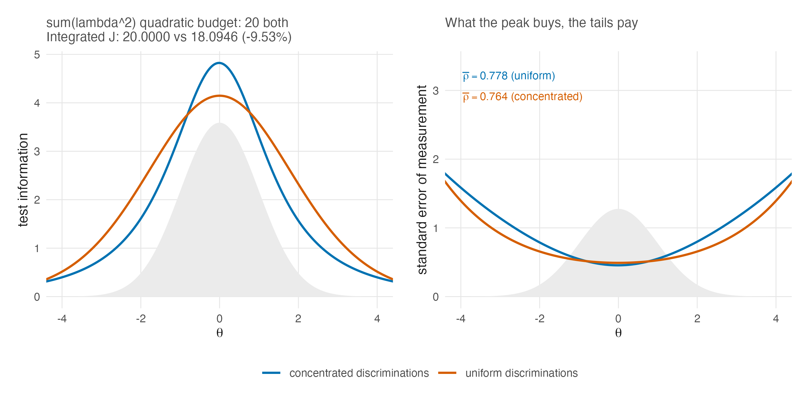

# Discrimination and Information {#sec-ch24}

The body of this book carries the two-parameter model everywhere the argument
needs it: @sec-ch03 defines it and records what it gives up, @sec-ch05 explains
why its item parameters cannot be conditioned away, @sec-ch06 specializes the
person estimators, and @sec-ch09 treats its discrimination scale as a design
lever. What those chapters do not do is sit with the model long enough to ask
what discrimination *does*. This part of the book does that in three steps:
information in this chapter, reliability in @sec-ch25, identification and the
DPM in @sec-ch26.

The organizing fact is easy to state. Under the Rasch model every item speaks
with the same voice, and a test's information profile is set entirely by where
its difficulties sit. Under the 2PL the items also differ in how loudly they
speak, and the analyst, or the estimation, decides where the volume goes.
Everything in this chapter is a consequence of that one addition.

## Where information comes from {#sec-ch24-source}

@sec-ch07-information built the information function for the Rasch model;
@sec-ch09-levers already displayed its 2PL form. An item with discrimination
$\lambda_i$ and difficulty $\beta_i$ contributes

$$
\mathcal{J}_i(\theta) \;=\; \lambda_i^2\, \pi_i(\theta)\,\{1 - \pi_i(\theta)\},
\qquad
\pi_i(\theta) = \operatorname{logit}^{-1}\{\lambda_i(\theta - \beta_i)\},
$$ {#eq-2pl-item-info}

and the test information is the sum. Two features of @eq-2pl-item-info do all
the work that follows.

First, the discrimination enters **twice**. The factor $\lambda_i^2$ raises the
item's ceiling: at its own difficulty, where $\pi_i = 1/2$, the item delivers
$\lambda_i^2/4$, against $1/4$ for a Rasch item. But the same $\lambda_i$ inside
the response function steepens the curve, so $\pi_i(1-\pi_i)$ collapses faster
as $\theta$ moves away from $\beta_i$. A discriminating item is a tall, narrow
tower of information; a weak item is a low, wide mound. The height-for-width
exchange is not conservation of total information, because
$d\pi_i/d\theta=\lambda_i\pi_i(1-\pi_i)$ and therefore

$$
\int_{-\infty}^{\infty}\mathcal{J}_i(\theta)\,d\theta
= \lambda_i\int_0^1 d\pi_i
= \lambda_i.
$$ {#eq-2pl-item-info-area}

Doubling $\lambda_i$ thus quadruples the peak, roughly halves the width, and
doubles the integrated item information.

Second, information remains **additive across items**, exactly as in
@sec-ch07-information, so a test is a portfolio. Difficulty controls where an
item contributes; discrimination changes its peak, width, and integrated area.
The Rasch model allocates equal-strength items by difficulty alone. The 2PL
adds a second decision that changes both how much integrated information the
portfolio carries and where that information lies.

## One quadratic budget, two allocations {#sec-ch24-budget}

The cleanest way to see the trade is to hold one particular budget fixed and
move its allocation. @fig-tif-concentration compares two twenty-item tests
with identical difficulties and identical quadratic-discrimination budgets
$\sum_i \lambda_i^2$; equivalently, that quantity is four times the sum of the
items' individual peak heights. It is not a conserved total-information
budget. One form spreads the quadratic budget evenly, while the other places
its strongest items at the centre of the population.

::: {#fig-tif-concentration}


:::

In the plotted construction, both quadratic budgets equal 20, but
@eq-2pl-item-info-area makes the integrated test information $\sum_i\lambda_i$:
20.0000 for the uniform form and 18.0946 for the concentrated form. The latter
is 9.53 percent lower. What the construction conserves is the summed item-peak
budget, not information integrated over the ability scale.

The concentrated test dominates where most examinees are and is much worse
where few are. Whether that is a good exchange depends entirely on the question
being asked of the scores, which is the recurring lesson of this book in a new
costume. For a fixed cut-score near the centre, concentration is close to
free. For individual estimates over the whole range, the tails of the shaded
population pay measurement error at rates the peak never repays — the printed
$\bar\rho$ values in the figure make the point, and @sec-ch25 explains why the
functional that produces them is the one that notices the deserts.

The figure provides a mechanism with which to read, but not causally explain,
a pattern in the companion simulation's design. At matched target reliability,
the calibrated 2PL forms are consistently *shorter* than the Rasch forms: the
realized ladder in @tbl-ladder-v2 of @sec-ch25 runs roughly seven items against
eight at the bottom tier and 62 against 68 at the top
[@lee_simulation_2026]. That ladder jointly calibrated test length and a global
discrimination multiplier $c^*$, however, and the model families also carry
different discrimination profiles. The observed length asymmetry therefore
belongs to the joint length-plus-$c^*$ design bundle. It is compatible with the
height, width, and area mechanism above, but it does not identify a causal
effect in which discrimination heterogeneity alone shortened the forms.

## What concentration does to scoring {#sec-ch24-scoring}

The estimation consequences follow from @sec-ch06 without new machinery, but
they are worth collecting, because each one turns into an empirical pattern in
the companion volumes.

**The score is no longer the raw sum.** @prp-nosuff established that the 2PL's
sufficient statistic for $\theta_p$ is the weighted score
$\sum_i \lambda_i u_{pi}$ (@eq-2pl-score). Concentration therefore changes not
just precision but *which response patterns are distinguished*: two examinees
with the same number correct part ways when their correct answers sit on items
of different weight. Under an ideal Rasch analysis with item parameters
treated as known and a common prior, the exact posterior depends on a response
vector only through its raw sum. Its posterior mean is therefore constant
within each raw-score class, and an $I$-item test supports at most $I+1$ such
values. Under a 2PL fit with heterogeneous discriminations the number of
attainable values multiplies. That ideal known-item result does not imply exact
equality in a joint item-and-person fit: shared item-parameter uncertainty can
produce real within-class variation in marginal person posteriors, with Monte
Carlo error adding approximation noise. The case-study's second-edition
external-review and correction record, not the cited case-study book itself,
establishes the empirical correction: the realized Rasch posterior means form
dense *bands*, not exact tied blocks. @sec-ch28 returns to what that banding
does to cut-score reporting and to the corrected mechanism for GR instability.

**Local error becomes locally unequal.** Under the Rasch model the standard
error profile of @sec-ch07 is a shallow bowl; under concentration it is a
valley with cliffs. The practical reading of panel (b) of
@fig-tif-concentration is that a concentrated test does not have "a"
measurement error to report. It has a schedule of them, and summaries that
average the schedule — every coefficient in @sec-ch08's zoo — will disagree
with one another more, not less, as concentration grows. That widening
disagreement is measurable on real tests, and @sec-ch25 measures it.

**Shrinkage becomes person-specific in a new way.** In the working model of
@sec-ch11 every person shrinks by the common factor $\bar w$; the exact Rasch
posterior already departs from that, and the 2PL departs further, because the
posterior variance of $\theta_p$ tracks $1/\mathcal{J}(\hat\theta_p)$ and the
2PL makes $\mathcal{J}$ vary sharply over the range. Examinees under the tower
are shrunk little; examinees in the desert are shrunk hard toward the centre.
The ensemble consequences — who moves, which tails compress — are exactly the
subject of the posterior-summary machinery of Part VI, which is why the
simulation's Rasch-versus-2PL contrast (H3) belongs to the evidence chapter
rather than here.

## Where the Rasch model sits in this picture {#sec-ch24-rasch}

It is tempting to read this chapter as a case against the equal-discrimination
model, and the temptation should be resisted. The Rasch model is the boundary
case $\lambda_i \equiv 1$, and the boundary has three properties the interior
lacks: the raw-score sufficiency of @thm-suff, with everything @sec-ch03 and
@sec-ch05 build on it; an information profile that cannot be silently
concentrated, so its reliability functionals disagree less (@sec-ch08); and a
scale fixed by the model itself rather than by a constraint on estimated
discriminations (@sec-ch04, and @sec-ch26 for what replaces it). The 2PL buys
fit and flexibility with exactly these coins. This book's position, stated in
@sec-ch22 and unchanged here, is that the choice is a design decision to be
made with open eyes, not a fit contest to be settled once for the discipline.

## Sources and provenance {#sec-ch24-sources}

@eq-2pl-item-info is the standard 2PL item information and restates
@sec-ch09-levers's display; Baker's 2PL treatment establishes it
[@baker_item_2004], and nothing here modifies it. Debelak et al. supply the
Rasch context used elsewhere in the book, not this 2PL information equation.
The peak value $\lambda_i^2/4$, the
height-for-width exchange, and the integral
$\int\mathcal{J}_i(\theta)d\theta=\lambda_i$ are immediate algebraic
consequences of the formula, computed, not sourced.

@fig-tif-concentration is computed for this chapter by exact quadrature under
$G = N(0,1)$ with the two discrimination allocations described in its caption;
the design is stylized and no empirical claim rests on it. Directly summing the
plotted discriminations gives 20.0000 for the uniform form and 18.0946 for the
concentrated form, while both sums of squares equal 20. The realized
form-length asymmetry placed beside that mechanism is the companion
simulation's, read from that volume's frozen design ladder
[@lee_simulation_2026] and displayed in @sec-ch25's @tbl-ladder-v2 with its
calibration multiplier intact. Because length and $c^*$ were calibrated
jointly, the ladder identifies only that design bundle, not a
discrimination-only cause.

The cited case-study volume supplies the exploratory cut-score observation
[@lee_casestudy_2026]. The bands-rather-than-exact-ties correction and its
near-rank-reassignment interpretation instead belong to that volume's
second-edition external-review/correction record, finding F-07; the book itself
is not credited with a correction it does not contain. The scoring consequences
in @sec-ch24-scoring otherwise follow from results already established in
@sec-ch06, @sec-ch07, and @sec-ch11, at the locations cited there.
