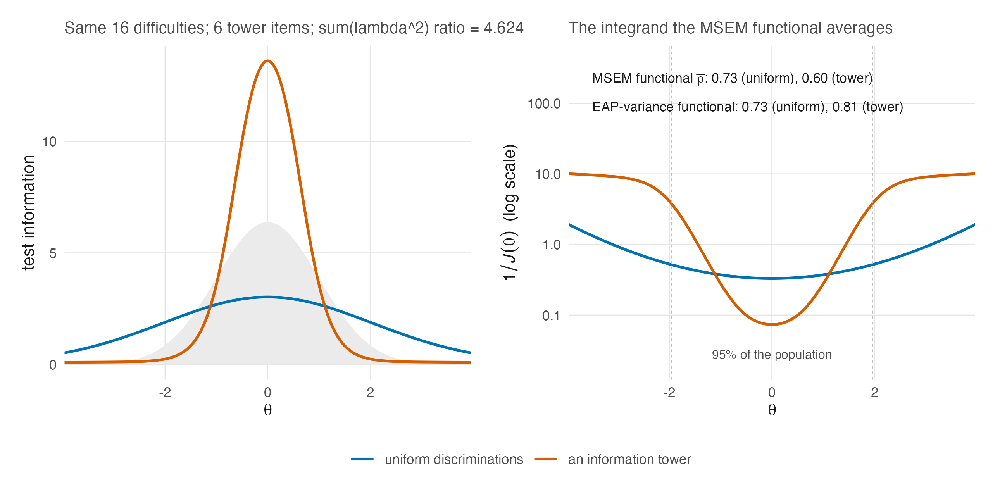

# Reliability Under the Two-Parameter Model {#sec-ch25}

```{r}
#| label: setup-ch25
#| include: false
tbl <- function(id) readRDS(file.path("..", "..", "tables", paste0(id, ".rds")))
```

@sec-ch08 made one claim repeatedly: a reliability coefficient is a functional
of the design and the population, every coefficient in circulation is the same
ratio with different estimates plugged in, and the choice among them matters
exactly as much as information varies over the population. Under the Rasch
model that variation is bounded, because items differ only in placement, and the
chapter could treat the disagreements among functionals as a caution. Under
the 2PL the caution becomes the story. Discrimination heterogeneity is
precisely a machine for making information uneven (@sec-ch24), and uneven
information is precisely the condition under which the members of the
reliability zoo part company.

This chapter states the mechanism and shows it in a stylized pair of tests. It
then asks how two operational catalogue coefficients move across thirteen real
tests, without treating that catalogue as a same-fit demonstration of the
stylized mechanism, and records two facts about the reliability ladder that the
evidence chapters depend on.

## The zoo, revisited where it bites {#sec-ch25-zoo}

Recall the two population functionals of @eq-functionals: the MSEM form
$\bar\rho$, which averages error variance $1/\mathcal{J}(\theta)$ over $G$ and
then forms the ratio, and the average-information form $\tilde\rho$, which
averages $\mathcal{J}$ first. @thm-jensen-sandwich orders them,
$\tilde\rho \ge \bar\rho$, with equality only when information is constant over
the population. A Rasch test can hold the gap modest. A 2PL test with
concentrated discriminations drives it wide, because $1/\mathcal{J}$ explodes
in the information deserts that concentration creates while
$\operatorname{E}[\mathcal{J}]$ barely notices them.

Alongside these sits the EAP-variance form, the variance of the posterior means
relative to the trait variance (@sec-ch08-functionals). It is computed from
realized posteriors. It should not be conflated with every coefficient that
fitted software calls "marginal reliability": in particular,
`mirt::marginal_rxx` integrates a pointwise information ratio and does not
compute the variance of EAPs or average posterior variances. A test that
concentrates information under the population mass can nevertheless score well
by the EAP-variance functional while scoring badly by the MSEM functional, and
the two can move in opposite directions when the model family changes.

@fig-rel-functionals exhibits the mechanism in its pure form: two sixteen-item
tests with identical difficulties, one uniform, one an information tower, for
which the MSEM functional prefers the uniform test by a wide margin while the
EAP-variance functional prefers the tower.

::: {#fig-rel-functionals}



:::

Neither functional is wrong. Both average with respect to a population $G$,
but they assemble uncertainty differently: $\bar\rho$ first uses inverse
information as an error-variance approximation, whereas the EAP-variance form
uses the spread of the exact posterior means under the fitted scoring model.
The 2PL manufactures designs for which those operations give different
answers. The practical rule this book keeps returning to gains a clause: a
reliability number needs its coefficient named, and under the 2PL it also
needs the model family named, because the family is part of what the
coefficient is measuring.

## Thirteen real tests, two catalogue summaries each {#sec-ch25-real}

The case-study volume fitted every one of its thirteen Item Response Warehouse
cases under both item models and placed two coefficients beside each other
[@lee_casestudy_2026]. The first is `mirt::marginal_rxx` from the Gaussian
`mirt` fit, an information-ratio coefficient rather than a posterior-variance
or EAP-variance coefficient. The second is the MSEM functional $\bar\rho$ of
@eq-functionals, evaluated from the separate empirical-histogram fit. The two
columns use the same response matrix within a case, but not the same fitted
object or the same functional. @fig-c4-reversal displays the full descriptive
catalogue, and @tbl-rel-gaps carries the values.

```{r}
#| label: fig-c4-reversal
#| fig-cap: "**Two catalogue coefficients can disagree about the direction of a Rasch-to-2PL change.** Each horizontal arrow runs from a case's Rasch value to its 2PL value. The left panel is `mirt::marginal_rxx` from each Gaussian fit; the right is $\\bar\\rho$ from each separate empirical-histogram fit. They agree in direction in six of thirteen cases, and C4 moves by roughly half a point in opposite directions. These are coefficients on identical responses but from distinct fitted objects, so the display is a catalogue discrepancy, not a same-fit causal diagnosis. Values are read from the first-edition repository's frozen P1-T2 analysis table; the cited case-study edition adds no fits or recomputed values [@lee_casestudy_2026]."
#| echo: false
#| fig-width: 8.4
#| fig-height: 4.6
rel_gap <- tbl("T-rel-gaps")
rel_gap <- rel_gap[order(as.integer(sub("^C", "", rel_gap$Case))), ]
rel_gap_long <- rbind(
  data.frame(
    Case = rel_gap$Case,
    Coefficient = "mirt marginal_rxx\n(Gaussian fit)",
    Rasch = as.numeric(rel_gap[[2L]]),
    TwoPL = as.numeric(rel_gap[[3L]])
  ),
  data.frame(
    Case = rel_gap$Case,
    Coefficient = "MSEM rho-bar\n(empirical-histogram fit)",
    Rasch = as.numeric(rel_gap[[4L]]),
    TwoPL = as.numeric(rel_gap[[5L]])
  )
)
rel_gap_long$Case <- factor(rel_gap_long$Case, levels = rev(rel_gap$Case))
rel_gap_long$Direction <- ifelse(
  rel_gap_long$TwoPL >= rel_gap_long$Rasch, "2PL higher", "Rasch higher"
)
ggplot2::ggplot(rel_gap_long, ggplot2::aes(y = Case)) +
  ggplot2::geom_segment(
    ggplot2::aes(x = Rasch, xend = TwoPL, yend = Case, colour = Direction),
    linewidth = 0.7,
    arrow = grid::arrow(length = grid::unit(1.7, "mm"), type = "closed")
  ) +
  ggplot2::geom_point(ggplot2::aes(x = Rasch), colour = "#202020", size = 1.6) +
  ggplot2::facet_wrap(~Coefficient) +
  ggplot2::scale_colour_manual(
    values = c("2PL higher" = "#0072B2", "Rasch higher" = "#D55E00"),
    name = NULL
  ) +
  ggplot2::scale_x_continuous(limits = c(0.2, 1), breaks = seq(0.2, 1, 0.2)) +
  ggplot2::labs(
    x = "reliability coefficient (dot = Rasch, arrowhead = 2PL)", y = NULL
  ) +
  ggplot2::theme_minimal(base_size = 10.8) +
  ggplot2::theme(
    legend.position = "bottom",
    panel.grid.minor = ggplot2::element_blank(),
    strip.text = ggplot2::element_text(face = "bold")
  )
```

```{r}
#| label: tbl-rel-gaps
#| tbl-cap: "Two catalogue coefficients on the thirteen case-study tests, under both item models. The mirt marginal column is computed from the Gaussian fit; the MSEM column is computed from the separate empirical-histogram fit. The final column asks whether they agree about the direction of the Rasch-to-2PL change. Source: tables/T-rel-gaps.rds. Frozen from the case-study analysis layer's P1-T2 catalogue."
#| echo: false
knitr::kable(tbl("T-rel-gaps"))
```

Two features deserve the reader's pause. The first is how often the arrows
disagree: the two catalogue columns agree about the direction of the item-model
change in only six of the thirteen cases. At the portfolio level the median
Rasch-to-2PL gap is $+0.215$ for `mirt::marginal_rxx` against $+0.004$ for the
empirical-histogram MSEM functional. Those medians describe the catalogue; they
do not isolate a coefficient effect because the fitted population model changes
with the column. The second feature is case C4, a
sixteen-item vocabulary checklist administered alongside a conspiracist-belief
scale. Its Gaussian-fit `mirt::marginal_rxx` rises from .30 to .78 when the 2PL
replaces the Rasch model, while the empirical-histogram MSEM functional falls
from .77 to .26. The responses are the same, but the coefficient and fitted
object are not. The magnitude makes the discrepancy important; it does not by
itself show that the information-tower mechanism in @fig-rel-functionals caused
it. Establishing that claim would require evaluating both target functionals on
the same fitted item parameters and the same $G$.

The lesson is not that one column of @tbl-rel-gaps is the true reliability.
It is that "is the 2PL more reliable than the Rasch model here?" is not a
well-posed question until the coefficient, fitted population model, and
averaging distribution are named. That is @sec-ch08's claim returned with real
data attached; the present catalogue does not separate those ingredients.

The corpus-scale version of the same lesson comes from the reliability study
of the Item Response Warehouse, whose complete analysis corpus contains 889
datasets. Across six estimators its reported pooled coefficients span .794 to
.868, and its estimated share below the .80 convention runs from roughly a
quarter to a half [@lee_reliability-distribution_2026]. The complete 889-row
per-unit snapshot used by this book's evidence pipeline is a frozen analysis
artifact, not the public replication frame: the latter contains 879 rows
because ten datasets are withheld. The quoted span and sub-.80 range are the
manuscript's full-corpus results, not a recomputation from the public 879-row
file. @sec-ch28 takes up the study properly; here the result shows that
definition-sensitive reliability is not confined to one small case portfolio.

## What the simulation's ladder actually manipulated {#sec-ch25-ladder}

The evidence chapters read results off a design in which reliability is a
manipulated factor, so this book must say precisely what the manipulation was.
Two facts matter, and both are read from the simulation volume's frozen design
tables rather than from its prose [@lee_simulation_2026].

**The operational coefficient is the information approximation.** The ladder
targets $\bar\rho$ in the form
$\sigma^2_\theta / \{\sigma^2_\theta + \operatorname{E}_G[1/\mathcal{J}(\theta)]\}$
— the population MSEM functional of @eq-wbar with information standing in for
estimator error variance. @sec-ch07 was explicit that information omits
calibration uncertainty and model error, and @prp-msem-jensen separates this
average from its companion; the ladder's "reliability" is therefore a specific,
computable functional, not a claim about any realized coefficient a fitted
run would report. The distinction did no harm in the design, since achieved
and target values agree to three decimals, but a reader who carries @sec-ch08's
vocabulary should know which member of the zoo the design axis is.

**The instrument was length *and* a discrimination multiplier.** Each cell of
the ladder was calibrated by choosing a test length and, jointly, a global
multiplier $c^*$ applied to the form's discriminations: the scale lever of
@sec-ch09-levers and @prp-cstar, exercised in production. @tbl-ladder-v2
displays the realized ladder with the multiplier column intact.

```{r}
#| label: tbl-ladder-v2
#| tbl-cap: "The companion simulation's realized reliability ladder: mean achieved reliability, mean calibrated test length, and the mean calibrated discrimination multiplier $c^*$, by item-model family and target tier. Read from the simulation volume's frozen rollup. Source: tables/T-ladder-v2.rds."
#| echo: false
knitr::kable(tbl("T-ladder-v2"))
```

The multipliers are not decoration: they range over roughly 0.79 to 1.09
across cells, and they are how the calibration hit its targets to within
0.003 at every tier. The consequence for interpretation is the one
@sec-ch09-table2 already taught for the manuscript's own Table 2, now applied
to the companion study: reliability was set *through* the design, so the
ladder's axis is a bundle, length and discrimination scale moving together,
and any statement of the form "the effect of reliability" is a statement about
that bundle. The simulation volume's own regression diagnostic makes the
entanglement concrete: achieved reliability and log test length correlate at
.98 across its estimation rows, and a model asking the two to speak separately
returns a variance inflation factor above thirty
[@lee_simulation_2026]. Nothing is wrong with the bundle as a design; things
would be wrong with reading it as a partial derivative. The open design that
*would* separate the levers, varying discrimination at fixed length, is
recorded as unfinished business in @sec-ch29.

## Sources and provenance {#sec-ch25-sources}

The two population functionals, their Jensen ordering, the EAP-variance
coefficient, and the source reading of `mirt::marginal_rxx` are @sec-ch08's;
nothing in @sec-ch25-zoo modifies them. @fig-rel-functionals is computed for
this chapter (exact quadrature for $\bar\rho$; a seeded 4,000-person computation
for the EAP-variance functional; values frozen in
`tables/F-rel-functionals-summary.rds`) and its design is stylized, chosen to
show that reversal is possible rather than to reproduce any case-study fit.

@tbl-rel-gaps and @fig-c4-reversal are read from the case-study analysis
layer's frozen P1-T2 catalogue [@lee_casestudy_2026]. The citation names the
second edition, which added no fits and recomputed no frozen values; this book
reads the P1-T2 table from the first-edition repository. Its left column calls
`mirt::marginal_rxx(fp$gauss)`; its right column evaluates `rho_bar_eh` from
`fp$eh`. Thus response data and item-model label are matched, while fitted
object and functional differ. The C4 values quoted in prose are asserted
against that table by the build before either display is written. The corpus
span .794 to .868 and the definition-dependent sub-.80 shares are the Item
Response Warehouse reliability study's full-889-dataset manuscript results
[@lee_reliability-distribution_2026], read from manuscript v3 dated 2026-08-06.
The evidence pipeline's complete 889-row snapshot is distinct from the public
879-row replication frame; @sec-ch28 gives the study design and fuller
provenance.

The ladder facts are the simulation volume's frozen rollup, surfaced here as
@tbl-ladder-v2 with the same assertions [@lee_simulation_2026]; the
correlation .98 and the variance inflation factor are that volume's own
published diagnostics, quoted as published. The reading of the ladder as a
bundle is this book's, and is the same reading @sec-ch09-table2 gave the
manuscript's design; the underlying scale-lever result is @prp-cstar, restated
from the reliability-targeting package [@lee_irtsimrel_2026], whose companion
paper develops the calibration algorithms themselves
[@lee_reliability-targeted_2026].
