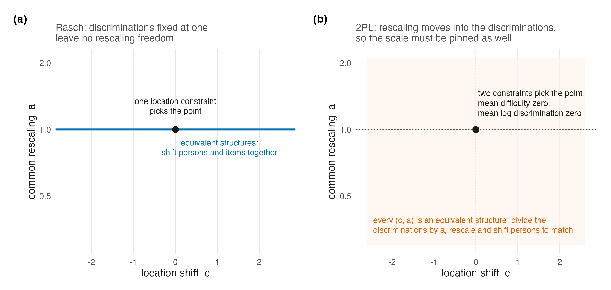

# Identification and the DPM Under the Two-Parameter Model {#sec-ch26}

@sec-ch04 separated location from scale and showed that under the Rasch model
the scale question either disappears (discriminations fixed at one) or, in one
parametric case, resolves from the data. @sec-ch16 then carried the location
argument into the semiparametric model and stated, in @prp-partial-id's
careful form, what an infinite-dimensional $G$ leaves identifiable from a
finite test. Both chapters did their work under $\lambda_i \equiv 1$. This
chapter asks what survives when the discriminations are free, and answers in
four parts: the location and scale freedoms form one positive-affine orbit;
the companion package exposes both within-model constraints and draw-wise
post-hoc normalization; the simulation and case-study analyses used different
members of those two computational regimes; and a finite known-item 2PL
identifies only response-pattern functionals of $G$, while the sharp joint
result with free item parameters remains open.

## The scale comes back {#sec-ch26-scale}

Under the 2PL the linear predictor is $\lambda_i(\theta_p - \beta_i)$.
For $c\in\mathbb R$ and $a>0$, @eq-2pl-scale-orbit gives the full joint orbit

$$
\theta_p^*=a(\theta_p-c),\qquad
\beta_i^*=a(\beta_i-c),\qquad
\lambda_i^*=\lambda_i/a,
$$

with $G^*$ the push-forward of $G$ under the same positive-affine map. Thus
$\lambda_i^*(\theta_p^*-\beta_i^*)=\lambda_i(\theta_p-\beta_i)$ exactly.
The restriction $a>0$ preserves the orientation of the trait and positivity
of every discrimination. The scale freedom that @prp-semi-scale showed the
Rasch model does not have is restored by exactly the parameter the 2PL adds;
location freedom persists as before. @fig-ident-2pl draws the two coordinates
of this single orbit side by side.

::: {#fig-ident-2pl}


:::

As in @sec-ch04, naming the orbit also names the repairs. One can pin the
latent side by fixing the location and scale of $G$, as a standard-normal
ability distribution does. Or one can select an item-side representative by
centring difficulties and discriminations, either inside the sampled model or
by transforming every draw afterward while leaving the shape of $G$ free.
What one cannot do is treat either convention as if the data chose the metric:
the normalization chooses a representative, and results on one metric do not
transport to another unless the whole affine conversion is stated.

## The two identification regimes the software actually exposes {#sec-ch26-software}

Following the discipline of @sec-ch10, the model must be described from the
package source rather than from a preferred abstraction. `DPMirt` exposes two
distinct 2PL routes [@lee_dpmirt_2026]. Its model-specific default is
`identification = "unconstrained"` (`R/utils.R`, lines 94--120). The raw model
therefore samples $\beta_i$, $\lambda_i$, and the latent distribution without
an in-model centring equation (`R/model_spec.R`, lines 427--449 and 501--529).
Because the top-level fit function separately defaults to `rescale = TRUE`, it
then maps every retained draw $s$ to

$$
c_s=\overline\beta_s,\qquad
d_s=\left(\prod_{i=1}^I\lambda_{is}\right)^{-1/I},\qquad
\beta_{is}^*=\frac{\beta_{is}-c_s}{d_s},\quad
\lambda_{is}^*=\lambda_{is}d_s,\quad
\theta_{ps}^*=\frac{\theta_{ps}-c_s}{d_s}.
$$ {#eq-2pl-posthoc}

This is exactly @eq-2pl-scale-orbit with
$a_s=1/d_s=(\prod_i\lambda_{is})^{1/I}$ and $c=c_s$; hence
$\overline\beta_s^*=0$ and the geometric mean of
$\boldsymbol\lambda_s^*$ is one. The dispatch and formulas are explicit in
`R/dpmirt.R` (lines 109--143 and 281--299) and `R/rescale.R` (lines 31--55,
80--100, and 194--288).

The alternative is `identification = "constrained_item"`. In that regime the
same representative is imposed *inside* the sampled model:

$$
\beta_i = \beta_i^{\mathrm{tmp}} - \overline{\beta^{\mathrm{tmp}}},
\qquad
\log \lambda_i = \log\lambda_i^{\mathrm{tmp}} - \overline{\log\lambda^{\mathrm{tmp}}},
$$ {#eq-2pl-constraints}

with independent normal priors on the temporary coordinates
($\log\lambda_i^{\mathrm{tmp}}\sim N(0.5,0.5)$ before centring), while the
location and dispersion of $G$ remain free. The implementing blocks are
`R/model_spec.R`, lines 451--472 and 531--559. Mean-difficulty centring pins
location; mean-log-discrimination centring pins scale by enforcing geometric
mean one.

These routes choose the same likelihood representative but are not thereby
the same Bayesian model: the priors are imposed before different constraint
operations, and post-hoc normalization does not retroactively turn an
unconstrained prior into the singular prior induced by in-model centring. The
distinction is operational in the evidence programme. The production
simulation job record explicitly sets `identification = "constrained_item"`
and passes it to the engine (production codebase `R/fit_jobs.R`, lines
183--188; `R/fit_preflight.R`, lines 177--203); its loss pipeline subsequently
maps fitted draws to the raw standardized generating scale. The case-study
fit driver passes neither `identification` nor `rescale` (`code/R/04-fit.R`,
lines 45--60), so its 2PL fits take the package default: unconstrained sampling
followed by @eq-2pl-posthoc. This is a declared implementation difference,
not evidence that one normalization is substantively truer.

Three cautions follow. First, log-centring is one defensible normalization
among several; estimates transport only after the full affine conversion.
Second, geometric-mean-one is a statement about the reported metric, not a
claim that true item discriminations average to one on an external scale.
Third, the latent scale rides on the discriminations, so fixed cutoffs,
quantiles, and density summaries must travel with the draw-wise transformation.

## What a finite 2PL identifies—and what remains open {#sec-ch26-limits}

@prp-partial-id is a sharp Rasch result whose $I+1$ displayed functionals come
from raw-score sufficiency. Under the 2PL that compression is gone
(@prp-nosuff). A more general finite-pattern statement nevertheless survives.

::: {#prp-2pl-pattern-id}
**Response-pattern-functional partial identification under a known-item
2PL.** *Derived here by finite-dimensional linear algebra.*

Fix known item parameters $\beta_i\in\mathbb R$ and $\lambda_i>0$ for
$i=1,\ldots,I$. For each response pattern
$\mathbf u\in\mathcal U=\{0,1\}^I$, let

$$
q_{\mathbf u}(\theta)=\prod_{i=1}^I
p_i(\theta)^{u_i}\{1-p_i(\theta)\}^{1-u_i},
\qquad
p_i(\theta)=\operatorname{logit}^{-1}
\{\lambda_i(\theta-\beta_i)\}.
$$

The observable pattern law identifies only the integrals

$$
\pi_{\mathbf u}(G)=\int q_{\mathbf u}(\theta)\,dG(\theta),
\qquad \mathbf u\in\mathcal U.
$$ {#eq-2pl-pattern-functionals}

There are $2^I$ such probabilities and they sum to one, so they supply at
most $2^I-1$ independent scalar functionals of $G$. Over the unrestricted
class of probability measures on $\mathbb R$, $G$ itself is not point
identified by a finite known-item test.
:::

**Proof.** The first display follows by local independence and marginalizing
$\theta$. Also $\sum_{\mathbf u}q_{\mathbf u}(\theta)=1$ pointwise, which gives
the normalization and the $2^I-1$ bound. Put $K=2^I$, choose $K+1$ distinct
points $t_1,\ldots,t_{K+1}$, and form the $K\times(K+1)$ matrix
$A_{\mathbf u j}=q_{\mathbf u}(t_j)$. Some nonzero vector $h$ satisfies
$Ah=0$. Since every column of $A$ sums to one, $\sum_jh_j=0$, so $h$ has both
positive and negative entries. Starting from strictly positive weights
$w_j=1/(K+1)$, choose $\varepsilon>0$ small enough that
$w_j^{\pm}=w_j\pm\varepsilon h_j$ remain nonnegative. Then
$G_+=\sum_jw_j^+\delta_{t_j}$ and
$G_-=\sum_jw_j^-\delta_{t_j}$ are distinct probability measures, yet
$A\mathbf w^+=A\mathbf w^-$, so every observable response-pattern probability
is identical. $\square$

The bound is deliberately "at most": special item configurations can create
further dependence. It is also not the Rasch theorem in disguise. Rasch
sufficiency reduces the likelihood to $I+1$ score-indexed functionals and
@prp-partial-id gives their sourced sharp characterization; the known-item 2PL
statement keeps the whole response-pattern alphabet and proves only the
finite-functional ceiling and non-identification of unrestricted $G$.

With $\boldsymbol\beta$ and $\boldsymbol\lambda$ free, the observable map is
joint in the item parameters and $G$, and it first must be quotiented by the
positive-affine orbit above. The finite-alphabet non-identification remains,
but a sharp analogue characterizing exactly which joint item-and-$G$
functionals survive is not established here or in this book's held sources.
That free-item joint problem remains open in @sec-ch29.

The identification duties of the DPM itself are unchanged in kind from
@sec-ch16. The base-measure warning of that chapter applies verbatim — centring
$H_0$ does not centre $G$ — and now has a scale-side twin: dispersing $H_0$
does not set the scale of $G$ either, so under item-side constraints the
realized location and dispersion of $G$ are estimands, to be read from the
posterior, not settings to be read from the prior. Across the companion
simulation's full 4,800-fit DP roster, spanning Rasch and 2PL cells, the
truncation guard fired five times; its convergence failures did not
concentrate in the 2PL DP arms [@lee_simulation_2026]. That is an operational
receipt for one constrained-item analysis, not evidence of identification in
the theoretical sense; the distinction is @sec-ch04's proper-posterior point,
still in force.

## Sufficiency, CML, and what the 2PL costs the argument {#sec-ch26-cml}

One consequence deserves restatement because it shapes what the companion
volumes can and cannot test. @sec-ch05 organized item estimation by what each
method assumes about $G$, with Rasch CML the unique corner assuming nothing.
The 2PL has no CML corner: with sufficiency lost, there is no conditioning
argument that removes the person parameters, so every 2PL fit in this
programme's evidence, simulation and case study alike, estimates the items
jointly with a model for $G$. It follows that under the 2PL one cannot
cleanly isolate "the cost of assuming a wrong $G$" from "the item estimates a
wrong $G$ induces," because there is no $G$-free item calibration to serve as
the reference arm. The simulation's Rasch-versus-2PL contrast (H3) is
therefore a comparison of *packages of consequences*, and @sec-ch27 reads it
that way; the case-study volume's finding that six of its thirteen cases
change shape classification between item models [@lee_casestudy_2026] is the
same package seen from the real-data side.

## Sources and provenance {#sec-ch26-sources}

The positive-affine orbit and its Rasch absence are @sec-ch04's, resting on
@sanmartin_identification_2016 at the locators given there;
@eq-2pl-scale-orbit is the display already carried by @sec-ch16. The sharp
Rasch partial-identification comparison is @prp-partial-id, resting on
@sanmartin_bayesian_2011 as read there. @prp-2pl-pattern-id is instead an
elementary finite-alphabet result derived and proved here: it does not claim a
sourced sharp theorem for the free-item 2PL. V8 constructs two distinct
finite-support laws with identical known-item pattern probabilities as an
executable check of its linear-algebra predicate.

The package contract is read directly from four source surfaces
[@lee_dpmirt_2026]: `R/utils.R` resolves a missing 2PL identification argument
to `unconstrained`; `R/model_spec.R` contains both unconstrained and
constrained-item model blocks; `R/dpmirt.R` defaults `rescale` to true and
dispatches post-processing; and `R/rescale.R` implements
@eq-2pl-posthoc. The production simulation job builder and preflight pin the
constrained-item branch, whereas the case-study fit driver omits both optional
arguments and therefore inherits the package's unconstrained-plus-post-hoc
defaults. The line locators are recorded where the regimes are described in
@sec-ch26-software.

The truncation-guard and convergence facts are the simulation volume's frozen
diagnostics, quoted as published [@lee_simulation_2026]; the shape-class
instability across item models is the case-study volume's catalogue
[@lee_casestudy_2026]. The remaining-open claim concerns the *sharp joint*
free-item characterization, not the known-item finite-pattern proposition;
absence from this book's held source inventory is disclosed rather than
promoted into a theorem.
