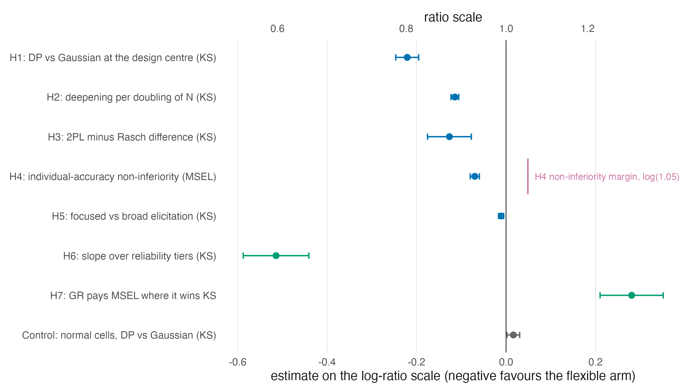
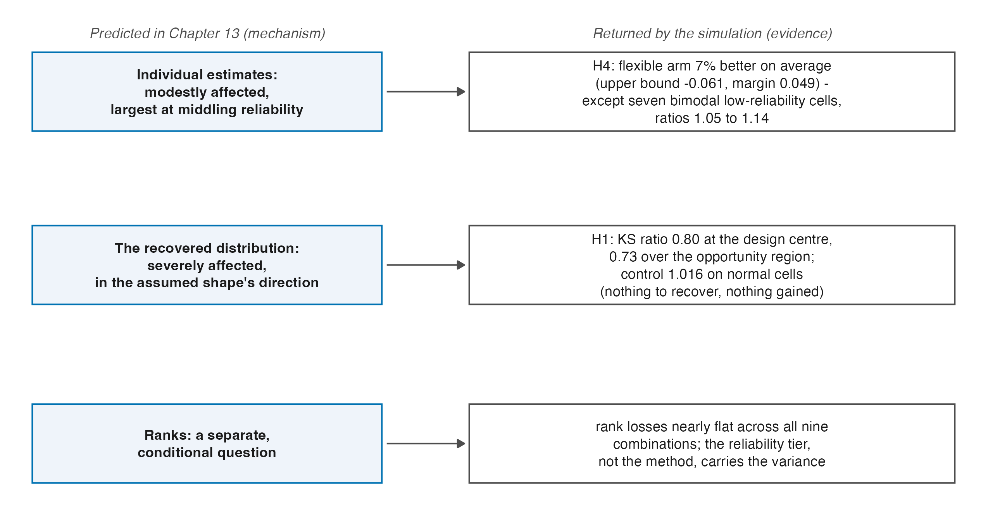

# What the Simulation Settled {#sec-ch27}

```{r}
#| label: setup-ch27
#| include: false
tbl <- function(id) readRDS(file.path("..", "..", "tables", paste0(id, ".rds")))
```

The chapters before this one were written to be true whether or not the
companion simulation was ever run, and Parts I through VIII keep that
discipline. This chapter is the deliberate exception announced in the front
matter. The simulation has been run (7,200 fits over 120 conditions, under a
preregistered plan with a sealed analysis path) and its realized results bear
directly on claims this book stated as mechanisms and predictions
[@lee_simulation_2026]. Reading them back into the theory is due diligence,
not contamination, provided three rules hold: every number is read from that
volume's frozen result store, confirmatory and exploratory findings are
labelled as such, and nothing is re-derived or re-analysed here. Those rules
are in force throughout this chapter, and the build enforces the first
mechanically: the displays below are generated from the frozen store with the
headline values asserted, so a divergence would fail the build rather than
enter the text.

A reader who wants the full evidentiary record, from design and gates to
diagnostics and sensitivity, should read the simulation volume itself. What belongs here is
narrower: which of this book's claims now carry evidence, which carry a
quantified exception, and which were sharpened in ways the theory should
absorb.

## The design, in one paragraph {#sec-ch27-design}

Two item-model families (Rasch, 2PL) crossed with three latent shapes
(normal, skewed, sharply bimodal), five reliability tiers (targets .5 to .9,
set by the calibrated bundle of @sec-ch25-ladder), and four sample sizes (50
to 500) give 120 conditions; twenty replicate datasets per condition; each
dataset fitted under a Gaussian prior and two DPM priors distinguished by
their concentration elicitation (@sec-ch15-elicitation), with the three
posterior summaries of Part VI (PM, CB, GR) extracted from every fit. Losses
follow the goals of @sec-ch17: squared error for individuals, a KS distance
between the reported ensemble and the realized trait distribution, rank,
quantile, and tail families alongside. Five primary hypotheses and a
calibration control were preregistered, with two secondary hypotheses added
by amendment before unblinding; all confirmatory contrasts run through one
Holm family each at $\alpha = .05$.

## The confirmatory record {#sec-ch27-record}

::: {#fig-evidence-forest}



:::

```{r}
#| label: tbl-evid-confirmatory
#| tbl-cap: "The preregistered primary family and its calibration control, read from the simulation volume's frozen fact store. Negative log ratios favour the flexible (DP-focused + GR) pipeline over the Gaussian default. Source: tables/T-evid-confirmatory.rds."
#| echo: false
knitr::kable(tbl("T-evid-confirmatory"))
```

```{r}
#| label: tbl-evid-secondary
#| tbl-cap: "The secondary family and the exploratory shape split of H6. The refit rows repeat the registered H6 regression separately on bimodal and skewed cells and are labelled exploratory in the source volume. Source: tables/T-evid-secondary.rds."
#| echo: false
knitr::kable(tbl("T-evid-secondary"))
```

Read against Part V and Part VI, the record settles four things within the
studied design, with confirmatory and exploratory strength stated separately.

**The distribution prediction held, at interpretable magnitude.** @sec-ch13-goal
predicted that a misspecified $G$ damages the recovered distribution most.
Realized: the flexible pipeline cuts KS loss to a ratio of .80 at the design
centre (H1), deepening by a factor of .89 per doubling of $N$ (H2), with a
mean ratio of .73 over the preregistered opportunity region: about a quarter
of the distribution-recovery loss removed where shape recovery is possible at
all, and up to half of it in the most informative corner. The calibration
control is the other half of the same finding: on normal cells the flexible
arm wins nothing and costs 1.6 percent, which is what "there was nothing to
recover" looks like when a design is honest about it.

**The individual-score prediction held, with its exception quantified.** The
predicted modest effect on individuals resolved into H4's non-inferiority
verdict (the flexible pipeline is about seven percent *better* on average
over the opportunity region, with the one-sided bound clearing the margin)
against a named exception: seven bimodal cells at the two lowest reliability
tiers, all with intervals excluding parity, where flexibility costs five to
fourteen percent on individual squared error. @tbl-evid-safety lists them.
The pooled H4 verdict is confirmatory; the seven-cell localization is the
source volume's post-outcome Addendum 006 disclosure, not a second
confirmatory contrast.
This is @sec-ch13's "largest at middling reliability" clause made precise, and
it is the region the case-study volume treats as recommendation-free
(@sec-ch28).

```{r}
#| label: tbl-evid-safety
#| tbl-cap: "The seven cells where the individual-accuracy safety screen fired: all bimodal, all at the two lowest reliability tiers, every interval excluding 1. This is the post-outcome Addendum 006 disclosure attached to the confirmatory pooled H4 result, not a separate confirmatory test. Source: tables/T-evid-safety.rds."
#| echo: false
knitr::kable(tbl("T-evid-safety"))
```

**Reliability gates the whole mechanism.** H6 puts a slope on what
@sec-ch11 and @sec-ch13 argued qualitatively: the flexible arm's advantage
shrinks steeply as the reliability tier falls, and the same regression run on
normal cells is flat: no shape, no gating. The exploratory split adds a
detail the theory did not predict: the gate is about three times steeper for
bimodal shapes than for skewed ones. The asymmetry has a mechanism worth
recording. Recovering two modes requires resolving individuals *between*
them, while recovering skew requires only getting a tail's mass right, and
the resolution demand is the reliability-hungry one. But the split sits
outside the preregistered family, and this book cites it as the source volume
labels it. The caveat of @sec-ch25-ladder travels with every H6 sentence:
"reliability" here names the design bundle, not a lever separated from test
length.

**The three-goals incompatibility is realized, not just possible.**
@thm-incompatible established existence: the three Bayes actions need not be
compatible in one estimate set. H7 measures the live version on the primary
diagonal of that triangle: the summary that wins distribution recovery pays
on individual accuracy, an average penalty of 0.281 log units, equivalent to
32.4 percent on the ratio scale. At the condition-mean point-estimate level,
239 of the 240 condition-by-prior points fall in the predicted quadrant. The
one exception is a near-parity KS result under the Gaussian prior in the 2PL,
$N=500$, target-reliability .9, sharply bimodal condition: the KS gap
$\log(L_{\mathrm{PM}}/L_{\mathrm{GR}})$ is $-0.004$, while the MSEL gap is
$-0.155$. The theorem said the goals *can* conflict; the pooled H7 result and
239-point census say they usually *do* in the predicted direction, without
turning one boundary-near exception into a universal.

```{r}
#| label: tbl-evid-h7-census
#| tbl-cap: "The H7 point-estimate census over the Gaussian and focused-DP arms. Positive KS gaps favour GR; negative MSEL gaps favour PM. The single exception is near parity on KS. This descriptive recount is separate from the pooled H7 test. Source: tables/T-evid-h7-census.rds."
#| echo: false
knitr::kable(tbl("T-evid-h7-census"))
```

## The two levers, ordered {#sec-ch27-levers}

Part VI treats the prior on $G$ and the posterior summary as two levers on
the reported ensemble. The simulation's exploratory decompositions order
them, and the ordering is the single most practice-relevant exploratory
pattern in the record.

```{r}
#| label: tbl-evid-levers
#| tbl-cap: "Within-condition swap factors: the geometric-mean range factor by which changing the summary (PM to CB to GR, prior held fixed) and changing the prior (Gaussian to DP, summary held fixed) move the condition-mean loss, with the two-way shares of the nine-combination spread. Exploratory decomposition, read from the frozen store. Source: tables/T-evid-levers.rds."
#| echo: false
knitr::kable(tbl("T-evid-levers"))
```

```{r}
#| label: tbl-evid-crossed
#| tbl-cap: "Exploratory crossed competition on KS loss: the right summary on the wrong prior against the wrong summary on the right prior, and the single-swap decomposition over non-normal cells. Source: tables/T-evid-crossed.rds."
#| echo: false
knitr::kable(tbl("T-evid-crossed"))
```

In this exploratory decomposition, on distributional losses the summary is
the larger lever, with swap factors
near 1.5 against 1.1 and roughly eighty percent of the nine-combination
spread against fourteen, and the crossed competition makes the ordering vivid:
a Gaussian prior read through GR beats a focused DP prior read through PM in
100 of the 120 cells. Both levers together are superadditive over the
non-normal cells: the summary swap alone removes about a quarter of KS loss,
the prior swap alone about an eighth, the pair together about forty percent.
For this book the implication runs straight back to Part VI's architecture:
the posterior summary is not a reporting detail appended to a model choice —
on these losses it is the primary decision, and the prior is the refinement.
The same exploratory record also locates where the levers are near-inert: on
rank losses the combinations are practically indistinguishable, with the
reliability tier carrying nearly all the variance (@sec-ch20's precision
reading, returned as data), and the descriptive evidence census records the
primary contrast's flags. Of 57 flagged cells, 49 intervals cross parity, two touch
parity from below, three lie strictly below parity without meeting the win
rule, and three lie strictly above parity and record a real cost, all on
normal shapes.

```{r}
#| label: tbl-evid-census
#| tbl-cap: "Exploratory descriptive census of the primary contrast's intervals over the 120 cells, with equality at parity separated from strict crossing and strict below/above categories. Source: tables/T-evid-census.rds."
#| echo: false
knitr::kable(tbl("T-evid-census"))
```

## Predictions against returns {#sec-ch27-verdicts}

::: {#fig-prediction-map}



:::

@fig-prediction-map closes the loop that @sec-ch13-goal opened. Over the
visited grid, registered contrasts support the distribution and individual
predictions within their stated domains. The distribution prediction also
holds in mechanism (largest effects exactly where reliability and sample size
make shape recoverable); the individual prediction carries the qualified
exception region above. The exploratory loss-family census, not a registered
rank hypothesis, places the rank prediction near flatness.
The Paddock et al. pattern this book flagged as its strong prior — sensitivity
concentrated in distributional functionals, robustness in ranks, the whole
effect reliability-dependent [@paddock_flexible_2006] — transfers to the
binary-response setting largely intact, which @sec-ch13's callout
predicted but could not assert. What the theory did not anticipate, the
record adds: the bimodal-versus-skew asymmetry in the gate, the exact location
of the exception region, and the size of the summary lever relative to the
prior lever. Those three now belong to the theory's working picture, at
exploratory strength for the first and third, and confirmatory strength for
the pooled individual-accuracy result underlying the second; its seven-cell
localization remains the post-outcome disclosure described above. The map is
a synthesis of registered results and exploratory censuses, not itself a new
confirmatory test.

## Sources and provenance {#sec-ch27-sources}

Every number in this chapter is read at build time from the simulation
volume's frozen fact store (`data/derived/book-facts.rds` of that repository)
or from tables derived from it by `code/R/20-evidence-tables.R`, with the
headline values asserted against the volume's published record before any
display is written; the volume itself is @lee_simulation_2026, and its
external review's independent reproduction of the confirmatory record is part
of why this book is willing to quote it. Confirmatory results quoted:
H1 through H5, the calibration control, H6, H7. Exploratory results quoted
and labelled: the H6 shape split, the lever decomposition, the crossed
competition, the winner and evidence censuses. The design summary restates
that volume's frozen design tables; the H7 point census is a deterministic
recount of its frozen condition means, not a new fitted analysis; the ladder
caveat is @sec-ch25-ladder's.
@paddock_flexible_2006 is cited as in @sec-ch13, at the passages read there.
No result of this book's own is derived from the simulation's data, and no
simulation analysis is re-run here.
