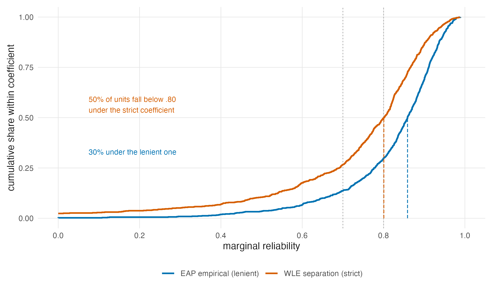
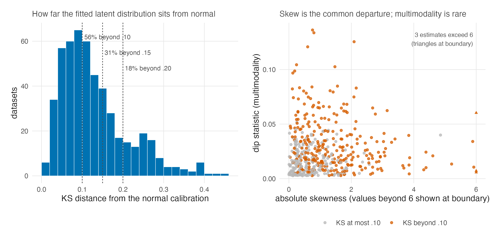
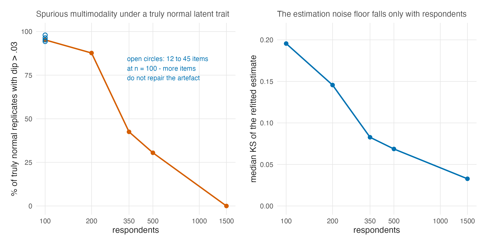

# What Real Tests Look Like {#sec-ch28}

```{r}
#| label: setup-ch28
#| include: false
tbl <- function(id) readRDS(file.path("..", "..", "tables", paste0(id, ".rds")))
```

Three empirical questions ran through this book with placeholders where
numbers should be. What reliability do real tests actually deliver
(@sec-ch01, @sec-ch08)? How often are real latent-trait distributions
non-normal, and in what way (@sec-ch13)? And when the prior and the summary
are changed on a real test, what actually moves (@sec-ch17 through
@sec-ch20)? Three studies built alongside this book now answer them at
corpus scale: two measurement censuses of the Item Response Warehouse
[@domingue_introduction_2025], and the case-study volume's thirteen fitted
cases [@lee_casestudy_2026]. This chapter reports what they found, under the
same rules as @sec-ch27: frozen sources, asserted numbers, labels preserved.

One vocabulary rule needs stating before the case-study results, because
this book must not launder a distinction its source is scrupulous about. The
case-study volume has no access to truth and therefore issues no correctness
claims; its registered vocabulary is that an output *differs*, *moves*,
*reorders*, or *reclassifies* under a method change, with materiality
thresholds declared in advance. Which method is *better* is the simulation's
question (@sec-ch27), never the case study's, and sentences below quoting the
case study inherit that grammar.

## The reliability real data deliver {#sec-ch28-reliability}

The Warehouse reliability study applied the same estimators under the same
rules to 889 item-response datasets, with no reporting filter and no author
discretion, and measured the distribution of marginal reliability that
psychological measurement actually produces
[@lee_reliability-distribution_2026].

::: {#fig-irw-reliability}



:::

```{r}
#| label: tbl-irw-reliability
#| tbl-cap: "The corpus distribution of marginal reliability across 889 Item Response Warehouse datasets, under the study's two co-primary definitions. All rows but the last are computed at build time from the study's frozen complete 889-unit analysis snapshot; the public derived release contains 879 rows because ten source rows cannot be redistributed. The deconvolved row is the study's own three-level model estimate, carried as published. Source: tables/T-irw-reliability.rds."
#| echo: false
knitr::kable(tbl("T-irw-reliability"))
```

The 889-versus-879 distinction is provenance, not attrition in the reported
analysis. The manuscript analyzes 889 units; the public derived frame omits
ten rows whose source licenses do not permit redistribution. This build reads
the frozen complete analysis snapshot so that its unit counts and summaries
match the manuscript, and separately checks that the public release has 879
rows. The identical 879 in the table's WLE `Units` cell is a different count:
valid WLE estimates within the complete snapshot, not the public frame's row
count.

Three of its findings matter here. **Low reliability is common**: even under
the lenient definition a third of datasets sit below .80, and under the
strict one half do. The design range the companion simulation walks, tiers
.5 through .9, is therefore the range practice occupies, not a stress test
invented for effect. **The variation is real**: the study's deconvolution
puts estimation noise near one percent of the between-dataset variance, so
the spread in @fig-irw-reliability is a fact about instruments and
populations, not about sampling error. **The definition is load-bearing**:
across six estimators the pooled coefficient spans .794 to .868 and the
sub-.80 share runs from about a quarter to a half, which is @sec-ch08's zoo
measured in the wild, and @sec-ch25's warning given corpus-scale teeth. The
study's design lesson reaches @sec-ch09 as well: doubling test length
multiplies unreliability by about 0.78 in this corpus, against the 0.56 of
the Spearman–Brown idealization — real added items buy roughly half the
textbook gain.

One composition fact deserves preservation because it cuts against an easy
assumption: the corpus's largest datasets are *less* reliable than its
smaller ones, because very large public datasets are disproportionately
internet panels and national surveys carrying short embedded scales. Size is
not a proxy for measurement quality, in either direction.

## The shapes real latent estimates take {#sec-ch28-shapes}

@sec-ch13 closed the sum-score route to latent-shape evidence and named the
route that remains: fit a flexible $G$ and look at it, with the caution that
the look is only as good as the regularization. The Warehouse shape study
executed that route at scale: 504 datasets fitted twice under identical
controls, once with a normal latent distribution and once with a flexible
one, the two calibrations differing in nothing else
[@lee_theta-nonnormality_2026].

::: {#fig-irw-shapes}



:::

```{r}
#| label: tbl-irw-shape
#| tbl-cap: "Latent-departure prevalence across the 504 analyzed datasets, computed from the study's corrected released frame at build time. The KS distance is on the cumulative-probability scale: a value of .10 means the flexible estimate places ten points more or less mass below some threshold than the normal calibration does. Source: tables/T-irw-shape.rds."
#| echo: false
knitr::kable(tbl("T-irw-shape"))
```

The headline is that departures are the norm, not the exception: the median
dataset's flexible estimate sits .109 from its normal calibration in
cumulative probability, a majority sit beyond .10, and nearly a fifth beyond
.20. The morphology matters as much as the prevalence. Large departures are
overwhelmingly *skew* (median absolute skewness .80), while pronounced
multimodality is a minority feature (median dip .018). Two consequences for
this book's argument follow. First, @sec-ch13's substantive mechanisms
(prevalence skew for symptom traits; mixed populations for multimodality)
now have base rates attached: the skew mechanism is everywhere, the mixture
mechanism real but rarer. Second, the companion simulation's sharply bimodal
generating condition sits in the *tail* of practice, not its centre: it is
the right stress test for the mechanism the DPM most distinctively repairs,
and the wrong picture of the modal dataset, and @sec-ch27's results should
be transported with that weighting in mind. The study's own sensitivity
grid supplies the calibration this chapter would otherwise owe: what the
flexible calibration changes most is not reliability (median absolute change
.002 with items fixed) but item estimates and person scores, with a median 4.8
percent of persons crossing the $|z| = 1$ reference under refitting. The
distributional assumption is therefore a reporting-level choice with
person-level consequences, unevenly spread across output families. That is
@sec-ch13-goal's prediction structure, observed in real calibrations.

## Where shape can be seen at all {#sec-ch28-floor}

Both censuses impose a floor of several hundred respondents, and the
case-study volume's null calibration explains why with a result this book
adopts as a standing caution.

::: {#fig-shape-null}



:::

```{r}
#| label: tbl-shape-null
#| tbl-cap: "Refits of truly normal data at case-study design sizes: the spurious-shape floor. More items sharpen the overall KS but do not repair spurious multimodality; only respondents do. Read from the case-study volume's frozen calibration. Source: tables/T-shape-null.rds."
#| echo: false
knitr::kable(tbl("T-shape-null"))
```

At one hundred respondents and twelve items, 95 percent of truly normal
replicates show a dip statistic beyond .03, which is spurious bimodality, and the
refitted estimate sits a median .196 from its own normal truth, larger than
the real-data median departure of @tbl-irw-shape. The artefact is a
respondent problem, not an item problem, and it fades only around three to
five hundred respondents. The case-study volume draws the operational
conclusion, which this book endorses: below the floor, a shape verdict should
be *undetermined*, not *normal*: the absence of evidence for a departure is
mostly the absence of resolution. Six of its thirteen cases change shape
classification between item models, which adds @sec-ch26's lesson: the shape
being classified is the shape of an estimated, metric-dependent object.

## What moves on real tests {#sec-ch28-moves}

The case-study volume fitted its thirteen cases under both item models and
all three priors, read all three summaries from each fit, and asked, output
family by output family against thresholds declared before fitting, what
*materially* differs [@lee_casestudy_2026].

```{r}
#| label: tbl-materiality
#| tbl-cap: "The case-study volume's materiality census: of the 21 placed case-cells in each shape class, how many show a material difference under the prior contrast, by output family. Read from the volume's frozen census. Source: tables/T-materiality.rds."
#| echo: false
knitr::kable(tbl("T-materiality"))
```

The following comparison is this book's descriptive cross-study synthesis,
not a preregistered case-study claim. The pattern is the simulation's
convergent twin, reached without truth: the
output family where the prior most consistently changes what is reported is
the **distribution**, where every bimodal and skewed case-cell is material,
while individual scores move materially in only one bimodal cell of seven,
and tails at fixed cuts barely move at all. A reader holding @sec-ch27's
winner maps beside this census sees the same geometry from two sides: where
the simulation says the flexible pipeline is most *right*, the case study
says the choice most *matters*.

One of the second edition's new decompositions cuts against an easy transfer
of @sec-ch27-levers, and this book states it rather than smoothing it over.
On the sixteen non-normal case-cells, the *prior* swap displaces the
reported distribution at least as much as the *summary* swap on every one,
while the summary swap is the larger mover of individual scores on all ten
normal and undetermined cells and clears the distributional materiality
threshold on 23 of the 26 cells, including both normal controls, where there
is nothing to recover [@lee_casestudy_2026]. This is not a contradiction of
the simulation's lever ordering, because the two volumes measure different
things. With truth in hand, @sec-ch27-levers prices which lever *improves*
distribution recovery, and the summary wins; without truth, the case study
measures which lever *moves* what is reported, and movement is not
improvement — a summary swap stretches every ensemble, right or wrong. The
moderator the case study supplies fits the working model of @sec-ch11:
summary-swap movement falls with reliability (a correlation of $-.59$ with
$\bar\rho$, from 0.118 SD below the .70 tier to 0.044 above .90), and this
portfolio lives mostly at high reliability, where the compression the
summary repairs is smallest. The reconciliation is the second edition's own
reading, offered with the data that motivate it rather than settled by them;
this book carries the displacement facts, the moderator, and the
distinction, and leaves the ordering claim where it is licensed — on the
losses, in @sec-ch27.

Two further case-study measurements deserve theory-side preservation.

```{r}
#| label: tbl-seed-floor
#| tbl-cap: "Top-decile churn from three sources: re-running the identical method at a new seed, changing the elicitation setting, and changing the prior family. Source: tables/T-seed-floor.rds."
#| echo: false
knitr::kable(tbl("T-seed-floor"))
```

**Selection has a noise floor.** Re-running the *same* method at a different
seed already changes two to nine percent of a top decile, depending on shape
class — six and a half on the bimodal cases, four on the normal controls, two
on the skewed (the placed classes @tbl-seed-floor displays), and nearly nine
on the undetermined cases the second edition adds to the headline; the
prior-family contrast adds to that floor rather than creating churn from
zero, on bimodal cases the elicitation contrast sits *at* the floor,
indistinguishable from doing nothing. Scope matters for the cellwise maximum:
across all 234 stored same-method prior-summary pairs the maximum is 32.35
percent, attained by three C12 fits; in the 26-cell Gaussian + PM subset
plotted in the case-study noise-floor figure, the maximum is 28 percent at C4
under Rasch.
@tbl-seed-extrema records both denominators. @sec-ch20 argued that ranking is
a precision problem; here is its Monte Carlo shadow, measured on real
posteriors, with the corollary that any selection-sensitivity claim must be
quoted net of the floor.

```{r}
#| label: tbl-seed-extrema
#| tbl-cap: "Worst same-method top-decile churn under the two scopes quoted in the companion record. Churn uses the corrected Jaccard-to-membership conversion. Source: tables/T-seed-extrema.rds."
#| echo: false
knitr::kable(tbl("T-seed-extrema"))
```

**This portfolio shows a 16/17-item reproducibility split, not a universal
minimum.** Across the volume's 78 replicate pairs, GR estimates failed to
reproduce within 0.10 SD on nine of 24 fits with twelve to sixteen items, and
on none of 54 fits with seventeen or more. That is a complete separation in
this portfolio, not an estimated population threshold, and convergence
diagnostics did not flag it: eight of the nine failures had clean
$\widehat R$. The corrected mechanism belongs to @sec-ch19's rank assignment.
The sorted GR mass points remain nearly fixed across refits, but tiny
perturbations change near-ranks and reassign people among those mass points;
exact posterior-mean ties are too rare to explain the failures. The practical
rider is therefore to replicate-seed-audit short tests in portfolios like this
one. These 78 fits do not establish a general 17-item floor.

## The verdict layer {#sec-ch28-verdict}

The second edition adds an explicitly **unpreregistered** layer the first
could not have: it joins each placed case-cell to its matched cell in the
simulation's grid and reads out, per goal, what the volume with truth
recommends there
[@lee_casestudy_2026]. Twenty-one of the 26 case-cells match a simulation
cell. Fifteen land in cells the simulation labels strong wins for the
flexible prior on distribution recovery, with KS loss ratios of 0.476 to
0.761 — a quarter to a half of the loss removed on tests like these. Six are
flagged, and the second edition insists on keeping the two kinds distinct:
five are normal-consistent cells with ratios of 0.988 to 1.041, flags of
imprecision around nothing, and one — C12 under the Rasch model — is the
substantive caution cell of @sec-ch27's safety screen. Across the matched
cells a GR combination wins the distribution goal in twenty of twenty-one
and a PM combination wins individual scores in all twenty-one, which is the
winner geometry of @sec-ch27 landing on real coordinates; and the price of
the operational default, Gaussian with posterior means, runs 1.36 to 2.54
times the winning combination's distributional loss, with a median of 2.08.
One label travels with all of this: the layer was assembled after both
volumes' results existed and is not preregistered — it is a join of two
frozen records, not a new experiment, and this book quotes it at that
strength.

## Sources and provenance {#sec-ch28-sources}

The reliability census is @lee_reliability-distribution_2026 and is read from
its frozen complete 889-unit analysis snapshot; its public derived release has
879 rows because ten cannot be redistributed. The prevalence census is
@lee_theta-nonnormality_2026 and is read from its *corrected* released frame,
which repairs a scale-dependence defect its external review found in the
original resampling analysis. The published medians and exceedance counts are asserted by
`code/R/20-evidence-tables.R` before any display is written; the deconvolved
shares and the sensitivity-grid values are the studies' own model-based
results, carried as published. The Warehouse itself is
@domingue_introduction_2025. The case-study results — materiality census,
null calibration, seed floor, portfolio-specific GR split, shape-class instability, the
displacement decomposition, and the verdict layer — are @lee_casestudy_2026,
cited in its second edition, whose analysis layer (the P-series tables and
the claim register) remains in the first edition's repository; this book's
pipeline reads that frozen layer directly (P3-T17, P1-T6, P3-T15, and the
replicate-audit records), and the second edition adds no fits and recomputes
no frozen number. Quotation follows the volume's registered consequence
vocabulary, with its corrections of record honoured — including the
Jaccard-to-membership conversion its corrigendum fixed — and with its own
labels preserved: the seed-floor headline widened to two-to-nine percent by
the undetermined class, the 32.35-percent all-pairs maximum kept distinct from
the plotted Gaussian + PM subset's 28-percent maximum, the verdict layer
marked as unpreregistered, and the displacement-versus-improvement
reconciliation attributed to that edition
rather than asserted as settled. The cited volume supplies the *exploratory*
cut-score observation E-01 and the frozen 16/17-item counts. The
bands-rather-than-exact-ties correction and the near-rank-reassignment
mechanism come instead from the second edition's external-review/correction
record, finding F-07; they are not attributed to the case-study book itself.
The 16/17 split is quoted only for this 78-fit portfolio. The convergence
reading between the two companion volumes in
@sec-ch28-moves is this book's, and it is a statement about where the
evidence agrees, not a new analysis.
